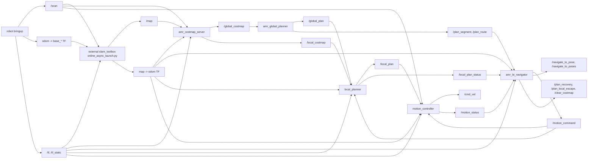
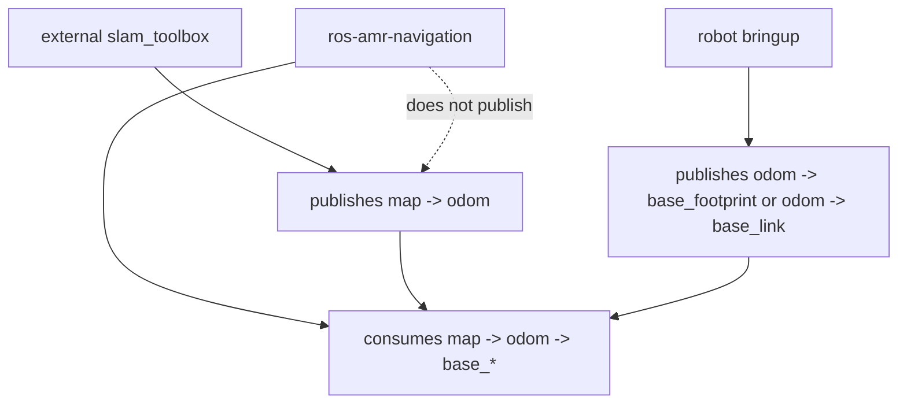
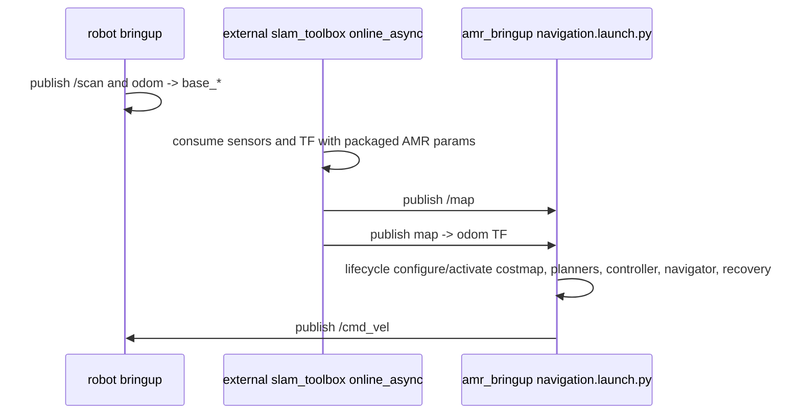
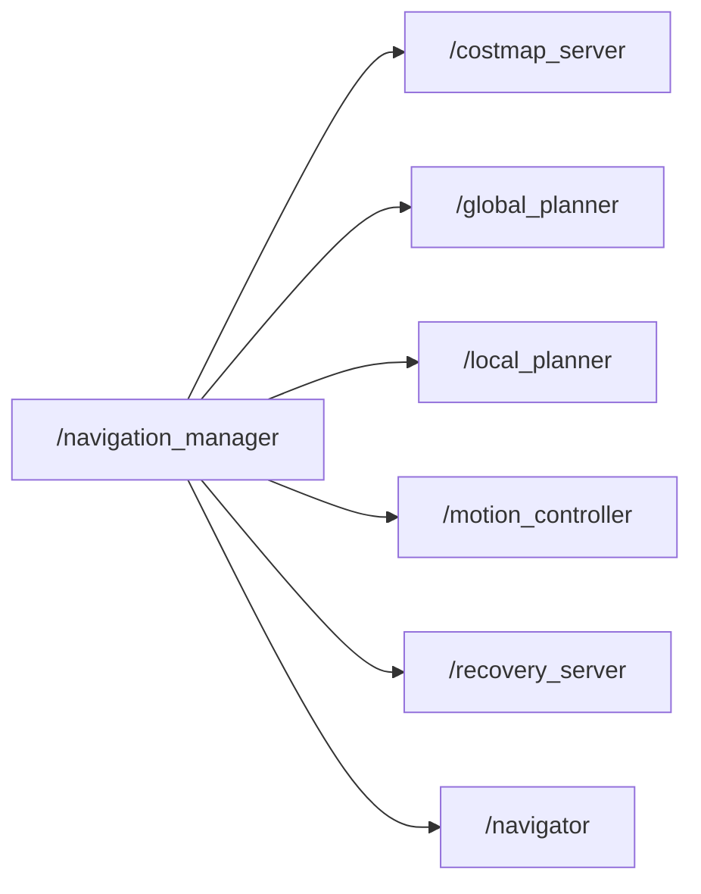

# Architecture Diagrams

## Online SLAM Navigation

## TF Ownership

The AMR navigation launch must not start any node that publishes `map -> odom`.
`amr_localization` is therefore not part of the navigation core.

## Launch Sequence

## Navigation Core Lifecycle

`/navigation_manager` manages only navigation core lifecycle nodes. It does not
publish an initial pose by default; `/initialpose` remains a `slam_toolbox`/RViz
interface.

The lifecycle nodes are launched in the root namespace. Their managed names are
`/costmap_server`, `/global_planner`, `/local_planner`, `/motion_controller`,
`/recovery_server`, and `/navigator`.
