# ROS2 Based AMR Navigation Stack Mermaid Diagrams

문서 내 다이어그램 삽입 위치별 Mermaid 코드 목록임. 각 항목을 렌더링해 해당 목차 위치에 삽입하면 됨.

## 1.3 개발 로드맵

```mermaid
timeline
    title ROS2 Based AMR Navigation Stack Roadmap
    0.1.x : A* global planning MVP
          : AMCL-lite localization
          : PID motion control
    0.2.x : Costmap-based replanning
          : SLAM-lite mapping workflow
          : lifecycle bringup
    0.3.x : Dynamic obstacle split
          : centralized costmap ownership
          : total bringup stabilization
    0.4.x : Early visualization scaffold
    0.5.x : Operator architecture transition
          : robot/operator role split
          : visualization contract cleanup
    0.6.x : Direct operator tooling
          : interactive control panel
    0.7.x : Operator session recovery
          : TF/rendering stabilization
    0.8.x : Footprint-aware inflation
          : planning safety refinement
    0.9.x : BT navigator skeleton
          : escape/detour recovery flow
    0.10.x : Recovery server responsibilities
           : local costmap-driven dynamic handling
           : package consolidation
    0.11.x : Exact planning/control quality uplift
           : docs and package normalization
    0.12.x : Exact footprint navigation baseline
           : stable navigation runtime
    0.13.x : ARL / GL experimental track
           : deprecated after shared-path regression risk
    0.14.x : Mapping-line reboot
           : external SLAM temp-map consumer flow
    0.15.x : Navigation runtime hardening
           : recovery observability and regression baselines
    0.16.x : Local escape-first recovery refinement
           : corridor / doorway blocked-state tuning
           : final-approach stability cleanup
    0.17.x : Planner/controller quality uplift
           : smoother/path-handler style path quality
           : blocked semantics and path-rejoin quality
    0.18.x : Safety + task-layer navigation operations
           : near-field safety lane
           : route/waypoint command-state contract maturity
    0.19.x : Docking and deployment readiness
           : dock/undock lifecycle
           : startup/shutdown/reconnect diagnostics
    1.0.0 : Single-robot indoor AMR operational closure
```

## 2.4 시스템 컨텍스트 다이어그램

```mermaid
flowchart LR
    Operator["운영자"] --> UI["amr_visualization\nROS2 + Qt6 Operator App"]
    UI -->|ROS2 Action / Service / Topic| Runtime["AMR Navigation Runtime"]
    Runtime --> RobotIF["Robot Base Interface\n/tf / scan / odom / cmd_vel"]
    RobotIF --> Robot["Robot Hardware"]
    Robot --> Sensor["LiDAR / Odometry / TF"]
    Sensor --> Runtime

    subgraph Runtime["AMR Navigation Runtime"]
      Map["Map Server"]
      Loc["Localization"]
      Costmap["Costmap Server"]
      GPlan["Global Planner"]
      Ctrl["Controller Server\nLocal Planner + Motion Controller"]
      BT["BT Navigator"]
      Recovery["Recovery Server"]
      Obs["Runtime Observation"]
    end
```

## 3.1 아키텍처 구성도

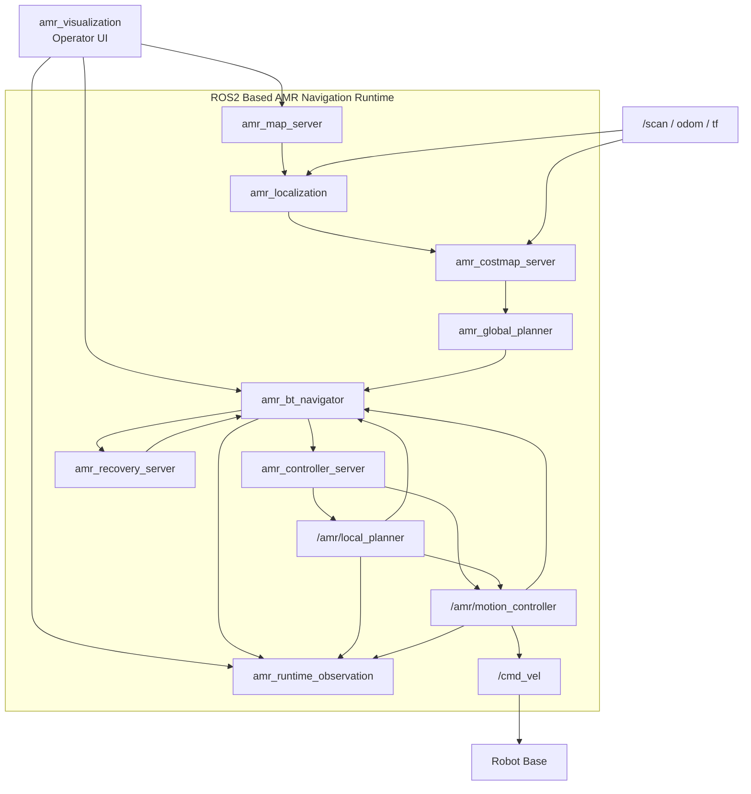

## 4.1 패키지 구성도

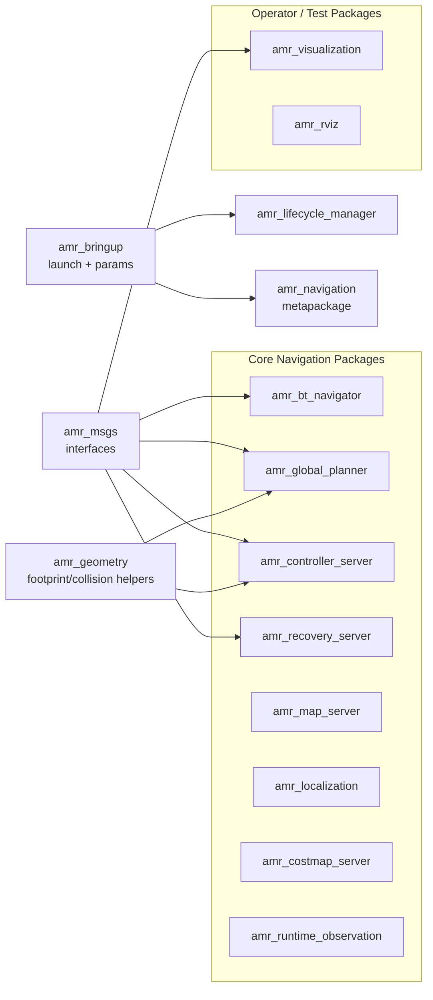

## 4.2 실행 환경 구성도

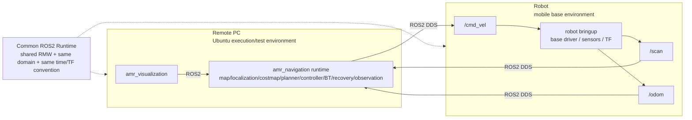

## 5.1 Localization 흐름도

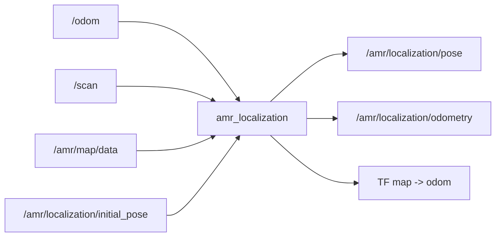

## 5.2 Map lifecycle 흐름도

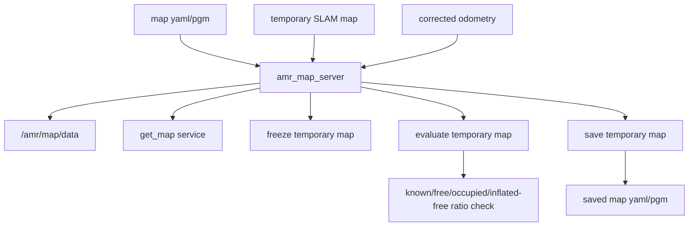

## 5.3 Costmap 흐름도

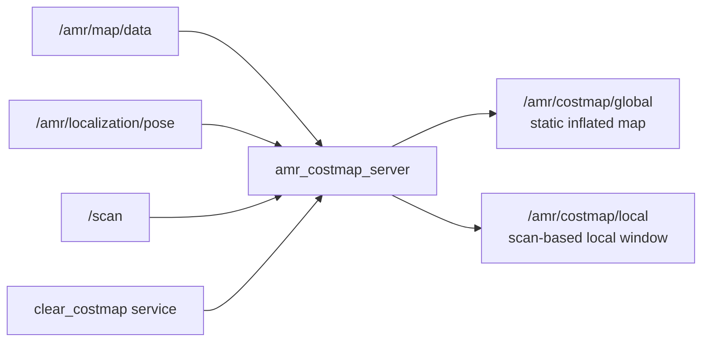

## 5.4 Global planning 흐름도

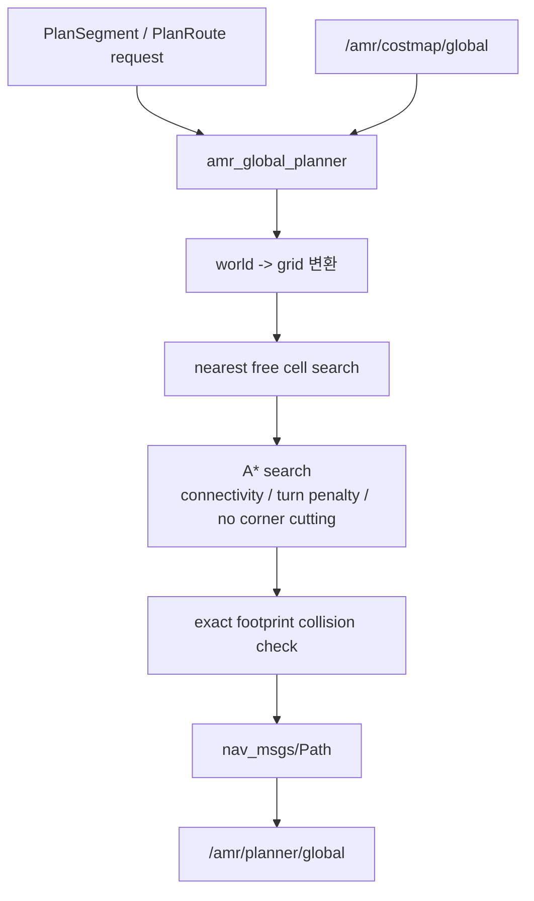

## 5.5 Local planning and path refinement 흐름도

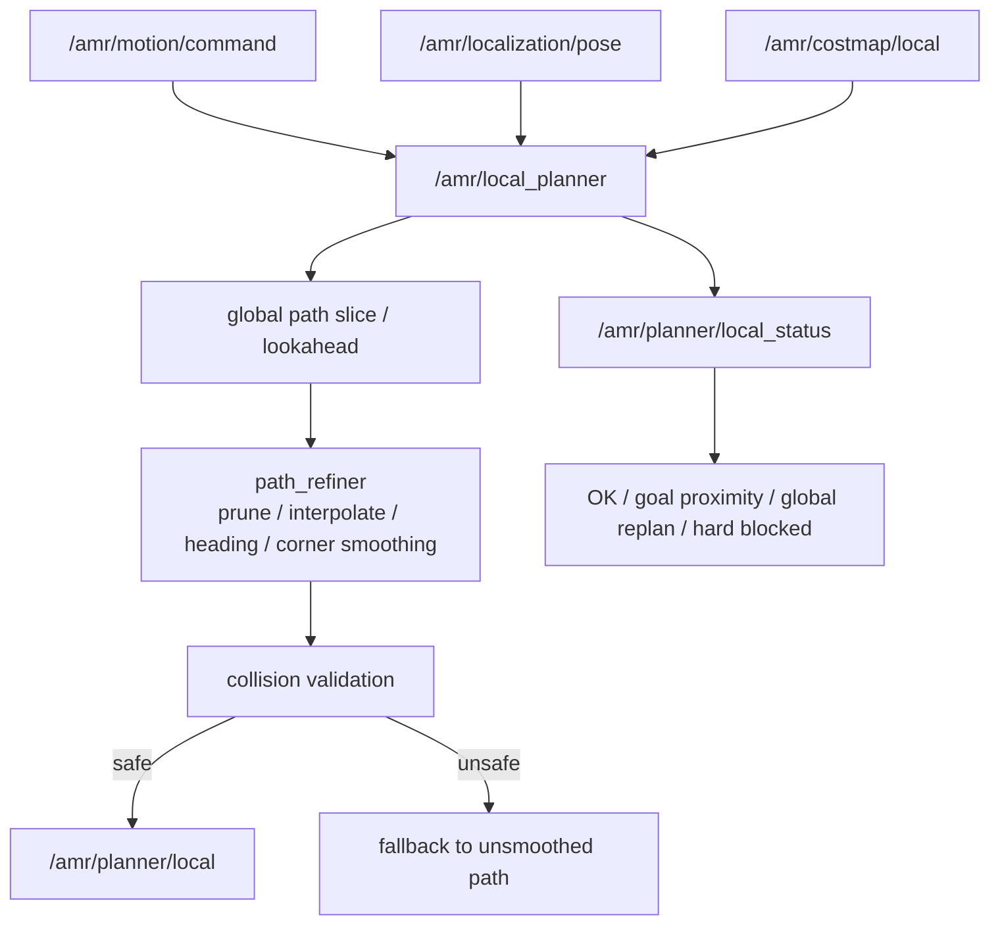

## 5.6 Motion control and goal checking 흐름도

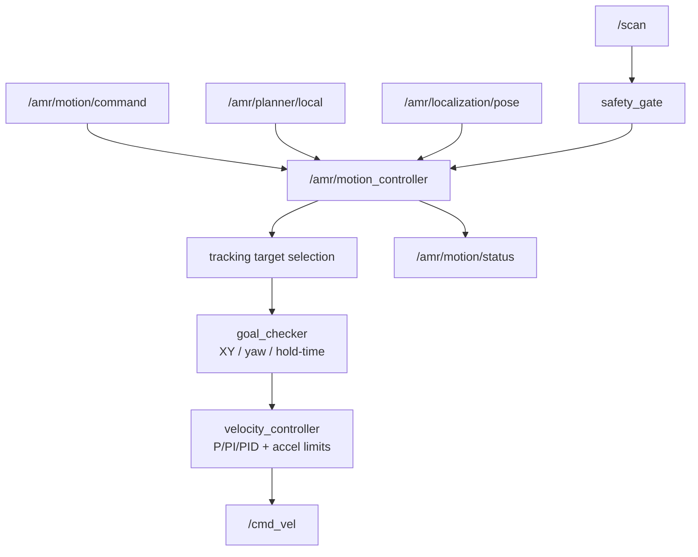

## 5.7 BT navigation and recovery orchestration 흐름도

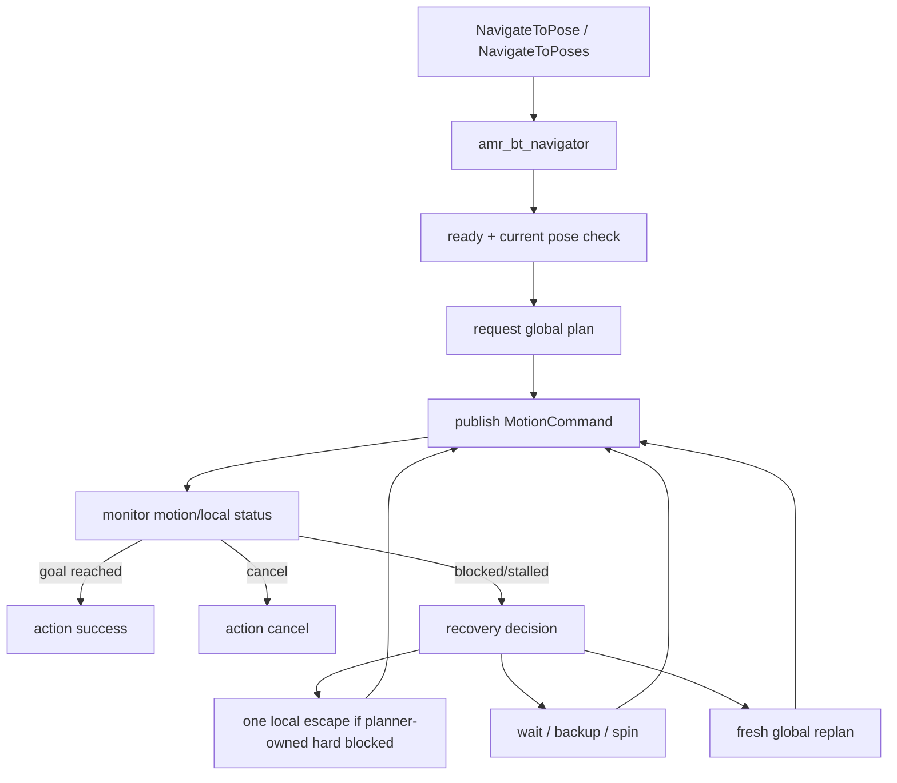

## 5.8 Runtime observation 흐름도

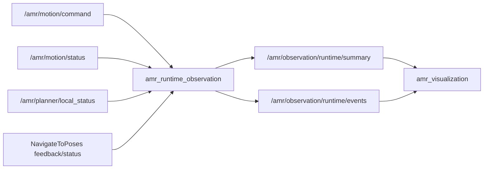

## 5.9 Operator visualization 흐름도

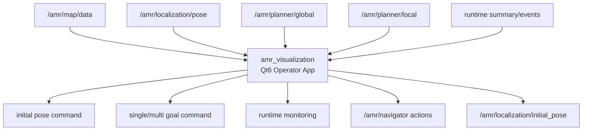

## 6.1 Full runtime bringup 시퀀스

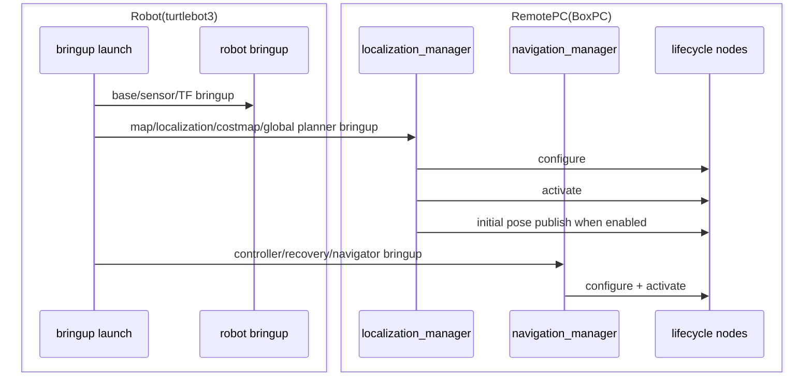

## 6.2 Single-goal navigation 시퀀스

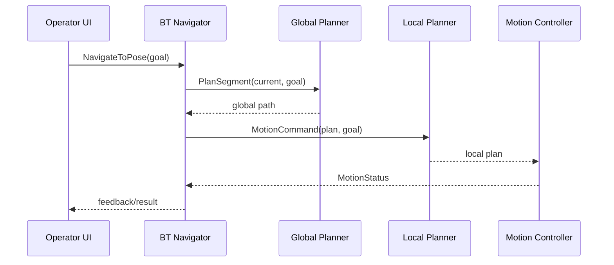

## 6.3 Multi-goal route navigation 시퀀스

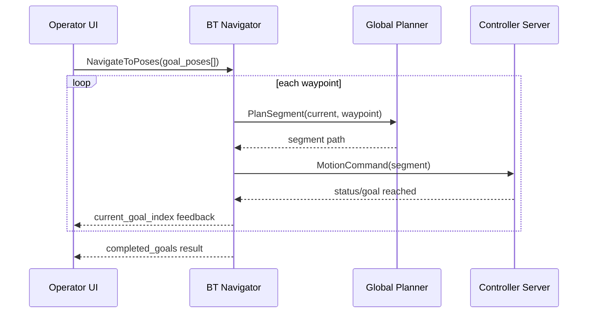

## 6.4 Dynamic obstacle and blocked-state handling 흐름도

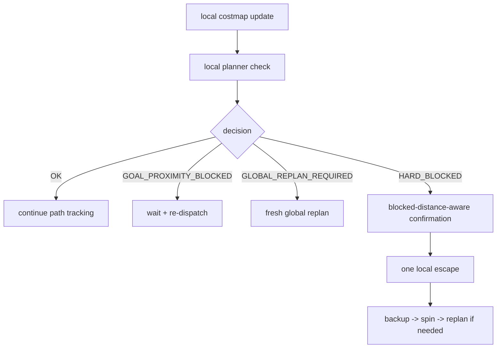

## 6.5 Recovery flow 시퀀스

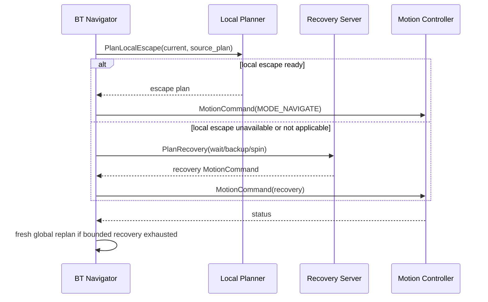

## 6.6 Final approach and goal completion 흐름도

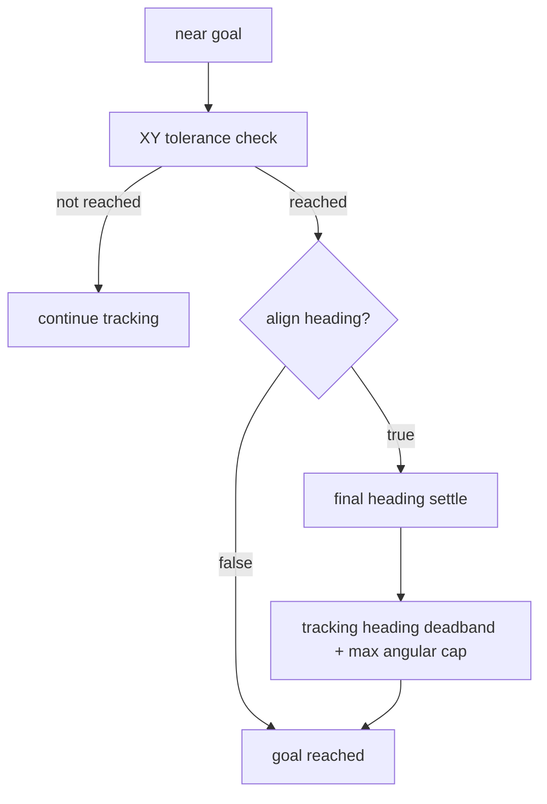

## 6.7 Map freeze / evaluate / save flow

```mermaid
sequenceDiagram
    participant UI as Operator UI
    participant Map as Map Server
    participant SLAM as Temporary map source
    SLAM-->>Map: temporary refined map
    UI->>Map: evaluate_temporary_map
    Map-->>UI: quality metrics result
    UI->>Map: freeze_temporary_map
    Map-->>UI: official map promoted
    UI->>Map: save_temporary_map
    Map-->>UI: saved yaml/pgm result
```

## 6.8 Operator monitoring flow

```mermaid
flowchart LR
    Map["map"] --> UI["amr_visualization"]
    Pose["pose"] --> UI
    Paths["global/local paths"] --> UI
    Status["motion + local planner status"] --> Obs["runtime observation"]
    Obs --> Summary["summary/events"]
    Summary --> UI
    UI --> Operator["operator decision"]
```

## 7.2 핵심 인터페이스 맵

```mermaid
flowchart TB
    UI["amr_visualization"] -->|Action| BT["/amr/navigator"]
    UI -->|Topic| Init["/amr/localization/initial_pose"]
    BT -->|Service| GP["/amr/global_planner/plan_segment"]
    BT -->|Service| LE["/amr/local_planner/plan_local_escape"]
    BT -->|Service| RS["/amr/recovery_server/plan_recovery"]
    BT -->|Topic| Cmd["/amr/motion/command"]
    LP["/amr/local_planner"] -->|Topic| LPlan["/amr/planner/local"]
    LP -->|Topic| LStatus["/amr/planner/local_status"]
    MC["/amr/motion_controller"] -->|Topic| MStatus["/amr/motion/status"]
    Obs["/amr/runtime_observation"] -->|Topic| Summary["summary/events"]
```

