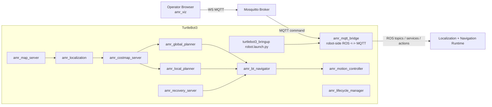

# ROS AMR Navigation

ROS 2 Humble based AMR navigation stack for TurtleBot3 Burger.

Current `0.12.0` direction:
- TurtleBot3 runs the full navigation runtime on-robot.
- `amr_mqtt_bridge` runs on the robot and publishes ROS telemetry and web-friendly viz topics to MQTT.
- `amr_viz` connects directly to MQTT over WebSocket.
- Recovery and decision flow follow a Nav2-like split:
  - `amr_bt_navigator` decides
  - planner / controller / recovery packages execute

## Architecture



## Active Packages

- `amr_bringup`: central launch files and `amr.yaml`
- `amr_bt_navigator`: BT-based goal orchestration and recovery decisions
- `amr_costmap_server`: static global costmap + scan-based dynamic local costmap
- `amr_global_planner`: A* planner on the global costmap
- `amr_local_planner`: local slicing, local replan, and local escape service
- `amr_localization`: localization and `map -> odom`
- `amr_map_server`: static map serving and optional mapping mode
- `amr_motion_controller`: path tracking, stop logic, and progress checking
- `amr_mqtt_bridge`: robot-side ROS <-> MQTT bridge
- `amr_msgs`: custom messages, services, and actions
- `amr_navigation`: metapackage
- `amr_recovery_server`: wait / backup / spin recovery command generation
- `amr_viz`: React MQTT visualization client

## Removed Packages

These packages are no longer part of the active `0.12.0` stack:
- `amr_obstacle_detection`
- `amr_rviz_plugins`
- the old server-side `amr_mqtt_bridge`
- `amr_mqtt_robot_plugin` as a separate package name

## MQTT Model

Robot-side `amr_mqtt_bridge` publishes:
- raw ROS-oriented telemetry on `amr/robot/turtlebot3/telemetry/*`
- web-oriented JSON topics on `amr/robot/turtlebot3/viz/*`

`amr_viz` consumes:
- `amr/robot/turtlebot3/viz/map`
- `amr/robot/turtlebot3/viz/global_costmap`
- `amr/robot/turtlebot3/viz/local_costmap`
- `amr/robot/turtlebot3/viz/robot_pose`
- `amr/robot/turtlebot3/viz/global_path`
- `amr/robot/turtlebot3/viz/local_path`
- `amr/robot/turtlebot3/viz/motion_status`
- `amr/robot/turtlebot3/viz/scan`
- `amr/robot/turtlebot3/viz/tf`
- `amr/robot/turtlebot3/viz/tf_static`
- `amr/robot/turtlebot3/viz/robot_description`

Commands are sent on:
- `amr/command/navigate_to_pose`
- `amr/command/cancel_navigate_to_pose`
- `amr/command/set_initial_pose`

## Launch

TB3 full runtime:

```bash
ros2 launch amr_bringup turtlebot3.launch.py
```

Web viz:

```bash
cd amr_viz
npm install
npm run dev
```

## Build

```bash
colcon build --packages-select \
  amr_msgs \
  amr_map_server \
  amr_localization \
  amr_costmap_server \
  amr_global_planner \
  amr_local_planner \
  amr_motion_controller \
  amr_recovery_server \
  amr_bt_navigator \
  amr_lifecycle_manager \
  amr_mqtt_bridge \
  amr_bringup \
  amr_navigation
```
