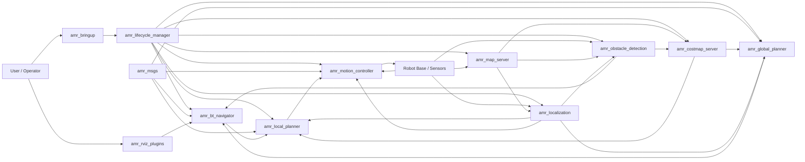
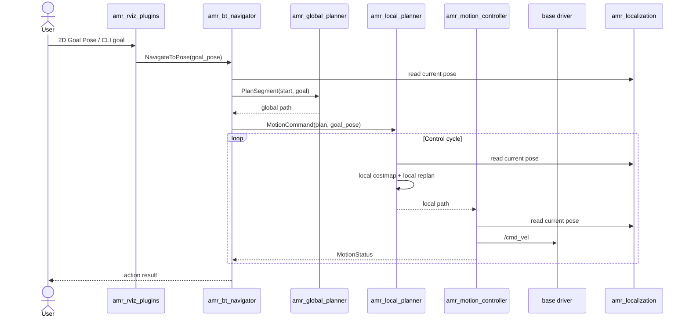
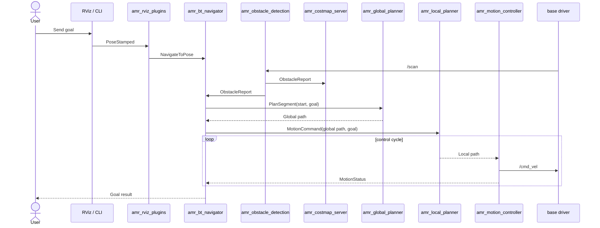
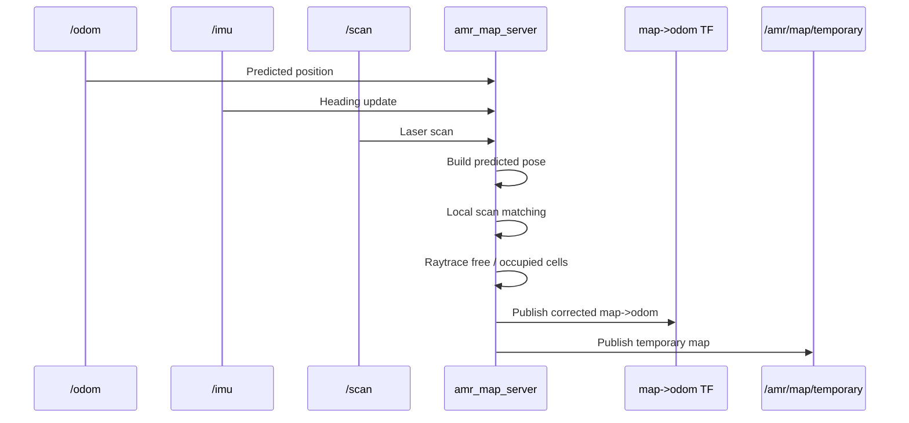
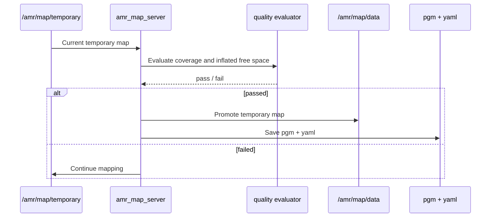
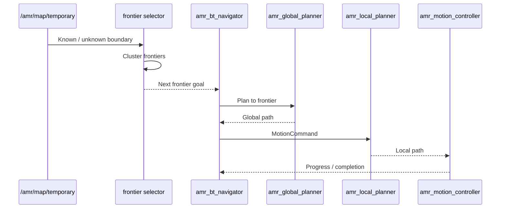

# ros-amr-navigation

Goal-driven ROS 2 AMR navigation stack for occupancy-grid maps, pose estimation, A* planning, local replanning, and velocity control.

## Packages

- `amr_navigation`
  - entry metapackage for building the full stack with `colcon build --packages-up-to amr_navigation`
- `amr_bringup`
  - owns launch files, shared runtime parameters, RViz config, and helper scripts
- `amr_msgs`
  - shared actions, services, and messages
- `amr_map_server`
  - owns the official navigation map and the temporary mapping map
- `amr_lifecycle_manager`
  - sequences lifecycle bringup and coordinates managed initial pose publication
- `amr_localization`
  - estimates the robot pose from `/odom`, `/scan`, and the static map
- `amr_obstacle_detection`
  - detects forward obstacles from `/scan` and publishes obstacle reports
- `amr_costmap_server`
  - owns the global and local costmaps used by the planners
- `amr_global_planner`
  - computes A* plans on the global costmap
- `amr_local_planner`
  - replans a short-horizon path on the local costmap
- `amr_motion_controller`
  - tracks the local plan and publishes `/cmd_vel`
- `amr_bt_navigator`
  - accepts `NavigateToPose`, requests a global plan, and dispatches motion commands
- `amr_rviz_plugins`
  - bridges RViz `2D Goal Pose` input to the AMR action server

## System Stack Architecture



English:
- `amr_bringup` and `amr_lifecycle_manager` bring up the managed nodes in a predictable order.
- `amr_map_server` owns the official map and optional temporary mapping flow.
- `amr_localization` provides the robot pose used by planning and control.
- `amr_obstacle_detection` converts raw scan data into obstacle reports with distance, bearing, and severity.
- `amr_costmap_server` is the single owner of the global and local costmaps.
- `amr_global_planner` computes goal-scale A* paths on the global costmap.
- `amr_local_planner` performs short-horizon replanning on the local costmap.
- `amr_motion_controller` converts the local plan into `/cmd_vel`.
- `amr_bt_navigator` orchestrates goal execution and planner/controller interaction.

한국어:
- `amr_bringup`과 `amr_lifecycle_manager`가 관리 노드들을 정해진 순서로 기동합니다.
- `amr_map_server`는 공식 맵과 optional temporary mapping 흐름을 관리합니다.
- `amr_localization`은 planning과 control이 사용하는 현재 pose를 제공합니다.
- `amr_obstacle_detection`은 raw scan을 거리, 각도, 위험도를 가진 obstacle report로 변환합니다.
- `amr_costmap_server`는 global/local costmap의 단일 소유자입니다.
- `amr_global_planner`는 global costmap 위에서 goal 규모의 A* 경로를 계산합니다.
- `amr_local_planner`는 local costmap 위에서 단거리 회피 경로를 생성합니다.
- `amr_motion_controller`는 local plan을 `/cmd_vel`로 변환합니다.
- `amr_bt_navigator`는 goal 수행과 planner/controller 연계를 총괄합니다.

## Package R&R

### Refactor Target (0.3.1)

| Package | Primary Responsibility | Explicitly Not Responsible For |
| --- | --- | --- |
| `amr_map_server` | Official map, temporary map, map freeze/save, map services | Costmap generation, obstacle judging, behavior sequencing |
| `amr_localization` | Pose estimation, `map -> odom` TF, localization outputs | Mapping policy, path generation, obstacle-response decisions |
| `amr_obstacle_detection` | `/scan`-based obstacle detection, distance/bearing calculation, risk scoring, dynamic obstacle reports | Path generation, recovery policy, `/cmd_vel` control |
| `amr_costmap_server` | Global costmap, local costmap, inflation, dynamic obstacle layer fusion | Goal handling, behavior decisions, velocity control |
| `amr_global_planner` | Global plan / replan on the global costmap | Sensor interpretation, local escape behavior, `/cmd_vel` |
| `amr_local_planner` | Local plan / replan on the local costmap, short-horizon path feasibility | Obstacle detection ownership, behavior sequencing, final motor command output |
| `amr_bt_navigator` | Goal execution flow, obstacle-response decisions, local/global replan command sequencing, recovery ordering | Costmap generation, low-level tracking, direct sensor fusion |
| `amr_motion_controller` | Pure local path tracking and final `cmd_vel` output, last-stage safety gate | Obstacle policy, replan decisions, map-based behavior logic |
| `amr_lifecycle_manager` | Lifecycle sequencing and managed initial pose publication | Planning, control, runtime obstacle decisions |
| `amr_rviz_plugins` | RViz goal bridging to the action server | Planning, control, localization, obstacle reasoning |
| `amr_bringup` | Launch composition, shared runtime wiring, parameter entry points | Runtime decision making inside the stack |
| `amr_msgs` | Shared interfaces between runtime packages | Runtime behavior or algorithms |

English:
- `amr_obstacle_detection` should detect and describe obstacles, not decide the navigation behavior.
- `amr_costmap_server` should be the single owner of global and local costmaps.
- `amr_global_planner` and `amr_local_planner` should only plan or replan on costmaps.
- `amr_bt_navigator` should decide what to do next: continue, wait, local replan, global replan, recovery, or abort.
- `amr_motion_controller` should focus on path tracking and keep only the final safety gate near the robot.

한국어:
- `amr_obstacle_detection`은 장애물을 검출하고 설명만 해야 하며, 행동 결정까지 가져가면 안 됩니다.
- `amr_costmap_server`는 global/local costmap의 단일 소유자가 되어야 합니다.
- `amr_global_planner`, `amr_local_planner`는 costmap 위에서 plan/replan만 수행해야 합니다.
- `amr_bt_navigator`는 계속 진행, 대기, local replan, global replan, recovery, abort 중 무엇을 할지 결정해야 합니다.
- `amr_motion_controller`는 path tracking에 집중하고, 로봇 근접 구간의 최종 safety gate만 남기는 것이 맞습니다.

## Execution Flow



## Algorithms

This section summarizes the major runtime features of the AMR stack and the algorithm flow behind each one.  
이 섹션은 현재 AMR 스택의 주요 기능과 각 기능의 알고리즘 흐름을 요약합니다.

### 1. Goal Navigation

English:
- The operator sends a goal from RViz or CLI.
- The navigator requests an inflated-grid A* global plan.
- The local planner builds a short-horizon path on the local costmap.
- The motion controller tracks that path and publishes `/cmd_vel`.

한국어:
- 사용자가 RViz 또는 CLI로 goal을 보냅니다.
- navigator가 inflation이 적용된 grid A* global plan을 요청합니다.
- local planner가 local costmap 기반 단거리 경로를 다시 계산합니다.
- motion controller가 그 경로를 추종하며 `/cmd_vel`을 발행합니다.



### 2. Bootstrap Mapping With Odom, IMU, and Scan Matching

English:
- Mapping mode starts from a temporary occupancy grid.
- `/odom` provides position prediction.
- `/imu` stabilizes yaw.
- Local scan matching refines the predicted pose before each scan is inserted.
- The corrected pose is also used to publish `map -> odom` for RViz alignment.

한국어:
- mapping mode는 temporary occupancy grid에서 시작합니다.
- `/odom`이 위치 예측을 제공합니다.
- `/imu`가 yaw를 안정화합니다.
- local scan matching이 각 scan 적재 전에 예측 pose를 미세 보정합니다.
- 그 보정 pose로 `map -> odom` TF도 발행해 RViz 정합성을 높입니다.



### 3. Temporary Map Quality Evaluation and Freeze/Save

English:
- The temporary map is evaluated by coverage and planning-readiness metrics.
- Known/free/occupied ratios are checked.
- An inflation-aware free-space ratio is used as a lightweight planning feasibility check.
- If the map passes, it can be promoted to `/amr/map/data` and saved as `pgm + yaml`.
- The same flow can be triggered manually or automatically after consecutive successful evaluations.

한국어:
- temporary map은 coverage와 planning 가능성 기준으로 평가됩니다.
- known/free/occupied 비율을 점검합니다.
- inflation 이후 free-space 비율을 이용해 경로 생성 가능성을 가볍게 확인합니다.
- 기준을 통과하면 `/amr/map/data`로 승격하고 `pgm + yaml`로 저장할 수 있습니다.
- 이 흐름은 수동 service 또는 연속 통과 기반 자동 저장으로 동작할 수 있습니다.



### 4. Frontier Exploration Roadmap

English:
- Frontier means the boundary between known space and unknown space.
- Exploration should choose frontier goals instead of random goals.
- The mapper keeps updating the temporary map.
- A frontier selector can choose the next reachable frontier cluster.
- The navigator can then drive the robot to that frontier until the map is complete.

한국어:
- frontier는 known 공간과 unknown 공간의 경계를 뜻합니다.
- exploration은 무작위 goal보다 frontier goal을 선택하는 쪽이 적합합니다.
- mapper가 temporary map을 계속 갱신합니다.
- frontier selector가 다음에 갈 수 있는 frontier cluster를 선택합니다.
- navigator는 그 frontier까지 주행시키며 맵 완성도를 올립니다.



## Bringup

Build the full stack:

```bash
colcon build --packages-up-to amr_navigation
```

Start map, localization, and global planner first:

```bash
ros2 launch amr_bringup localization.launch.py
```

Start navigation execution in another terminal:

```bash
ros2 launch amr_bringup navigation.launch.py
```

Shared runtime parameters live in [amr.yaml](./amr_bringup/params/amr.yaml).

## Interfaces

### Action

- `/amr/navigator/navigate_to_pose`
  - `amr_msgs/action/NavigateToPose`

### Services

- `/amr/map_server/get_map`
  - `nav_msgs/srv/GetMap`
- `/amr/map_server/freeze_temporary_map`
  - `std_srvs/srv/Trigger`
- `/amr/map_server/evaluate_temporary_map`
  - `std_srvs/srv/Trigger`
- `/amr/map_server/save_temporary_map`
  - `std_srvs/srv/Trigger`
- `/amr/global_planner/plan_segment`
  - `amr_msgs/srv/PlanSegment`
- `/amr/global_planner/plan_route`
  - `amr_msgs/srv/PlanRoute`

### Topics

- `/amr/map/data`
  - `nav_msgs/msg/OccupancyGrid`
- `/amr/map/temporary`
  - `nav_msgs/msg/OccupancyGrid`
- `/amr/costmap/global`
  - `nav_msgs/msg/OccupancyGrid`
- `/amr/costmap/local`
  - `nav_msgs/msg/OccupancyGrid`
- `/amr/localization/pose`
  - `geometry_msgs/msg/PoseStamped`
- `/amr/localization/odometry`
  - `nav_msgs/msg/Odometry`
- `/amr/planner/global`
  - `nav_msgs/msg/Path`
- `/amr/planner/local`
  - `nav_msgs/msg/Path`
- `/amr/motion/command`
  - `amr_msgs/msg/MotionCommand`
- `/amr/motion/status`
  - `amr_msgs/msg/MotionStatus`
- `/cmd_vel`
  - `geometry_msgs/msg/Twist`

## Notes

- the current stack is an MVP-focused custom navigation pipeline
- `amr_localization` is AMCL-lite rather than a full Nav2-compatible AMCL replacement
- both global and local planning now operate on inflated occupancy data
- RViz `2D Goal Pose` can be sent directly to the action server through `amr_rviz_plugins`
