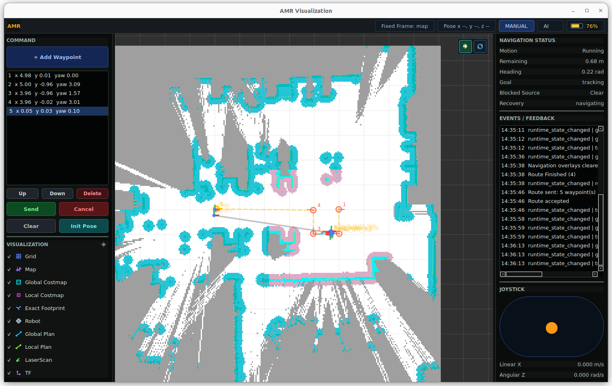
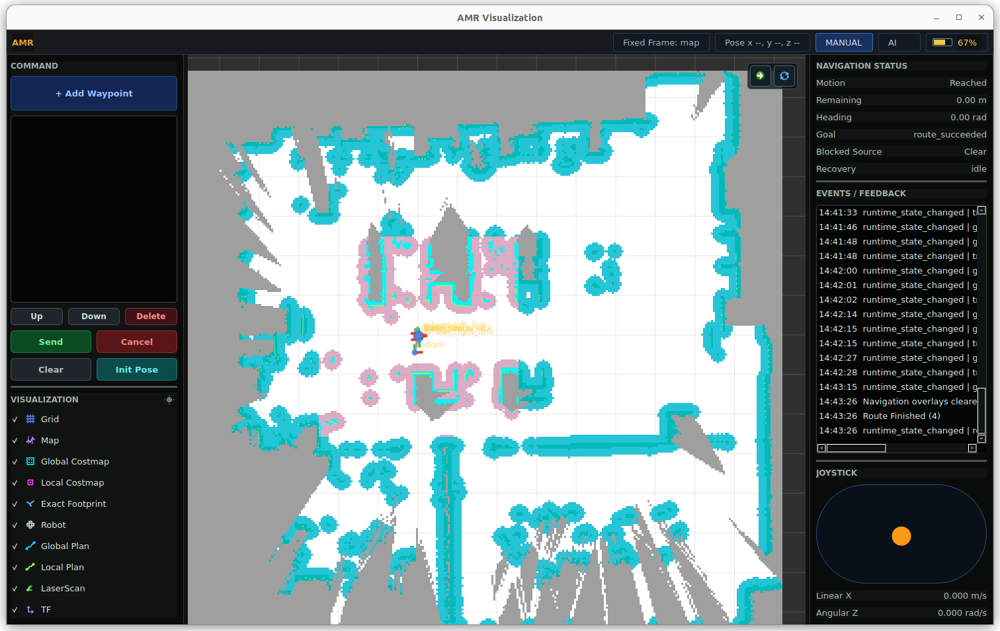
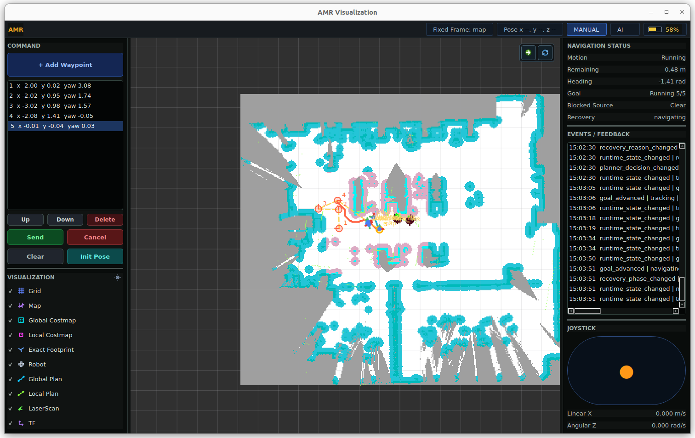

# ros-amr-navigation




`ros-amr-navigation` is now a navigation-only AMR stack designed for
`slam_toolbox + AMR` online-async navigation: robot bringup starts the sensors
and base, external `slam_toolbox` owns online SLAM/localization, and this stack
owns navigation.

The core runtime no longer launches or depends on the repository's legacy static
map server or AMCL-lite localization node. `slam_toolbox` owns online mapping,
localization, `/map`, and the `map -> odom` transform. This repository consumes
the standard ROS 2 interfaces and performs costmap generation, global planning,
local planning, behavior-tree navigation, recovery, motion control, runtime
observation, and optional visualization or MQTT bridging.

## Runtime Architecture

Required external inputs for `slam_toolbox + AMR` online-async navigation:

- robot bringup publishes `/scan`, `/tf`, `/tf_static`, and `/odom` or an `odom -> base_*` TF chain
- external `slam_toolbox` `online_async_launch.py` publishes `/map`
- external `slam_toolbox` publishes `map -> odom`

AMR navigation consumes:

- `/map`
- `/scan`
- `/tf`, `/tf_static`
- `map -> odom -> base_footprint` or `map -> odom -> base_link`

AMR navigation does not publish `map -> odom`. Do not run the legacy
`amr_localization` node with this navigation launch, because that would duplicate
the transform owned by `slam_toolbox`.

Manual static map preparation is not a prerequisite. A new environment can be
mapped online by `slam_toolbox` while this stack uses the live `/map` for
navigation.

## Launch Order

Terminal 1:

```bash
ros2 launch <robot_bringup_package> bringup.launch.py
```

Terminal 2:

```bash
ros2 launch slam_toolbox online_async_launch.py \
	slam_params_file:=$(ros2 pkg prefix amr_bringup)/share/amr_bringup/params/slam_toolbox.yaml \
	use_sim_time:=false
```

Terminal 3:

```bash
ros2 launch amr_bringup navigation.launch.py
```

Optional unknown-goal frontier navigation:

```bash
ros2 launch amr_bringup navigation.launch.py use_frontier_navigation:=true
```

Optional MQTT bridge:

```bash
ros2 launch amr_bringup navigation.launch.py use_mqtt_server:=true
```

`amr_bringup/launch/navigation.launch.py` keeps navigation nodes in the root ROS
namespace by passing `namespace=""` to each `LifecycleNode`. Do not introduce a
robot-specific namespace unless the topic contract below is intentionally
remapped.

## Core Packages

- `amr_costmap_server`: consumes live `/map`, `/scan`, and TF; publishes global and local costmaps
- `amr_global_planner`: plans on `/global_costmap` and publishes `/global_plan`
- `amr_controller_server`: hosts `local_planner` and `motion_controller`; the motion controller uses
  in-package Pure Pursuit with RPP-style adaptive lookahead, curvature, approach, and scan safety regulation
- `amr_bt_navigator`: exposes navigation actions and dispatches motion commands
- `amr_frontier_navigator`: optional unknown-goal orchestrator that resolves reachable known/free staging goals from live `/map` and delegates motion to `/navigate_to_pose`
- `amr_recovery_server`: creates recovery motion commands
- `amr_runtime_observation`: observes navigation status and emits runtime summaries
- `amr_lifecycle_manager`: lifecycle bringup for navigation core nodes only
- `amr_bringup`: navigation-only launch and parameters

`amr_bringup/params/slam_toolbox.yaml` is the packaged online-async
`slam_toolbox` parameter file for this navigation contract. It runs
`slam_toolbox` in `mode: mapping`, keeps `use_sim_time: false` by default, and
uses standard `/scan`, `/tf`, `/tf_static`, `/map`, and `map -> odom`
interfaces.

Legacy packages removed from the core navigation path:

- `amr_map_server`
- `amr_localization`

They have been replaced by the external `slam_toolbox` contract.
`amr_bringup/launch/navigation.launch.py` does not launch them, lifecycle
management no longer lists them, and `amr_bringup`/`amr_navigation` no longer
depend on them.

## Topic Contract

Inputs:

| Interface | Default |
| --- | --- |
| map | `/map` |
| scan | `/scan` |
| TF | `/tf`, `/tf_static` |
| initial pose | `/initialpose`, owned by `slam_toolbox`/RViz, not the AMR navigation core |

Outputs:

| Interface | Default |
| --- | --- |
| global costmap | `/global_costmap` |
| local costmap | `/local_costmap` |
| global plan | `/global_plan` |
| local plan | `/local_plan` |
| motion command | `/motion_command` |
| motion status | `/motion_status` |
| local plan status | `/local_plan_status` |
| velocity command | `/cmd_vel` |
| runtime observation summary | `/observation/runtime/summary` |
| runtime observation events | `/observation/runtime/events` |
| frontier original goal | `/frontier/unknown_goal` |
| frontier resolved known/staging goal | `/frontier/known_goal` |
| frontier global plan overlay | `/frontier/global_plan` |
| frontier local plan overlay | `/frontier/local_plan` |
| frontier status | `/frontier/status` |

Actions and services:

| Interface | Default |
| --- | --- |
| navigate to pose | `/navigate_to_pose` |
| navigate through poses | `/navigate_to_poses` |
| navigate to unknown pose | `/navigate_to_unknown_pose` |
| global plan segment | `/plan_segment` |
| global plan route | `/plan_route` |
| recovery plan | `/plan_recovery` |
| local escape plan | `/plan_local_escape` |
| clear costmap | `/clear_costmap` |

## Frames

Default parameters use:

- `frames.map: "map"`
- `frames.odom: "odom"`
- `frames.base: "base_footprint"`

If a robot bringup uses `base_link` instead of `base_footprint`, change
`frames.base` in `amr_bringup/params/amr.yaml` for the costmap server, local
planner, motion controller, and navigator.

## Startup Behavior

The navigation core tolerates online SLAM startup order:

- if `/map` has not arrived, costmap publication waits
- if `/map` changes size, origin, or resolution, costmaps rebuild from the latest message
- if TF lookup fails temporarily, costmap/local planner/controller/navigator wait or fail the current request without crashing
- if a global plan is requested before `/global_costmap` is ready, the planner service returns failure while the node remains alive

This behavior is intentional for online `slam_toolbox` operation where map and
TF can become available after navigation nodes are already active.

## Unknown Goal Navigation

`amr_frontier_navigator` is optional and disabled by default to preserve the
normal 0.19.3 known-goal behavior. When enabled, clients can send
`amr_msgs/action/NavigateToUnknownPose` goals to `/navigate_to_unknown_pose`.

The frontier navigator never forwards an unknown or out-of-map goal directly to
`amr_bt_navigator`. It checks the latest `/map`, finds a known/free staging goal
near the requested unknown target, falls back to reachable map-frontier cells
when needed, validates reachability with `/plan_segment`, then sends that
staging goal through the existing `/navigate_to_pose` action.
If SLAM map expansion later makes the original goal known/free, the node switches
to the original goal and preserves the user's original orientation.

`amr_visualization` keeps the existing `/global_plan` and `/local_plan` displays
for current navigation while adding separate frontier overlay layers for the
original goal, active known/staging goal, frontier global plan, and frontier
local plan. The UI uses one `Send` command for single goals; when
`ft_navigator` is available, `RosWorker` sends that request to
`/navigate_to_unknown_pose` so the backend can decide whether the goal is
already known/free or needs a staging goal.
