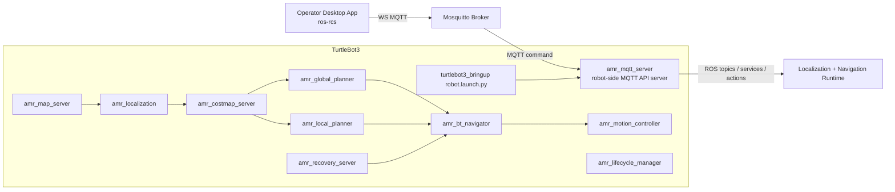

# ROS AMR Navigation

ROS 2 Humble based AMR navigation stack for TurtleBot3 Burger.

Current `0.15.4` direction:
- TurtleBot3 runs the full navigation runtime on-robot.
- `amr_mqtt_server` runs on the robot and publishes ROS telemetry and web-friendly viz topics to MQTT.
- the operator client now lives outside this repo as the desktop app in `ros-rcs`:
  - `https://github.com/reidlo5135/ros-rcs`
- Recovery and decision flow follow a Nav2-like split:
  - `amr_bt_navigator` decides
  - planner / controller / recovery packages execute

## Architecture



## Active Packages

- `amr_bringup`: central launch files and `amr.yaml`
- `amr_bt_navigator`: BT-based goal orchestration and recovery decisions
- `amr_costmap_server`: static global costmap + scan-based dynamic local costmap
- `amr_global_planner`: A* planner on the global costmap
- `amr_local_planner`: local slicing, local replan, and local escape service
- `amr_localization`: localization and `map -> odom`
- `amr_map_server`: official-map lifecycle, evaluation, and save/freeze services
- `amr_motion_controller`: path tracking, stop logic, and progress checking
- `amr_mqtt_server`: robot-side MQTT API server
- `amr_msgs`: custom messages, services, and actions
- `amr_runtime_observation`: runtime summary and event aggregation for navigation state
- `amr_navigation`: metapackage
- `amr_recovery_server`: wait / backup / spin recovery command generation
## Removed Packages

These packages are no longer part of the active stack:
- `amr_obstacle_detection`
- `amr_rviz_plugins`
- the old server-side `amr_mqtt_bridge`
- `amr_mqtt_robot_plugin` as a separate package name
- `amr_viz` in this repository

## MQTT Model

Robot-side `amr_mqtt_server` publishes:
- legacy ROS-oriented data streams on `/<root>/<robot_id>/telemetry/*`
- control and result topics on `/<root>/<robot_id>/<domain>/<channel>`

The external `ros-rcs` desktop client consumes:
- `/amr/burger1/navigation/feedback`
- `/amr/burger1/navigation/status`
- `/amr/burger1/navigation/result`
- `/amr/burger1/pose/result`
- `/amr/burger1/map/result`
- selected legacy data streams while the heavy data plane is being refactored

Commands are sent on:
- `/amr/burger1/navigation/command`
- `/amr/burger1/navigation/cancel`
- `/amr/burger1/pose/set`

Single-goal navigation also uses `/amr/burger1/navigation/command` with a one-element `goal_poses` array.

## Launch

TB3 full runtime:

```bash
ros2 launch amr_bringup turtlebot3.launch.py
```

Operator desktop UI is developed and packaged in the external `ros-rcs` repository.

## Build

```bash
colcon build --packages-select \
  amr_msgs \
  amr_map_server \
  amr_localization \
  amr_costmap_server \
  amr_global_planner \
  amr_local_planner \
  amr_motion_controller \
  amr_recovery_server \
  amr_bt_navigator \
  amr_runtime_observation \
  amr_lifecycle_manager \
  amr_mqtt_server \
  amr_bringup \
  amr_navigation
```
