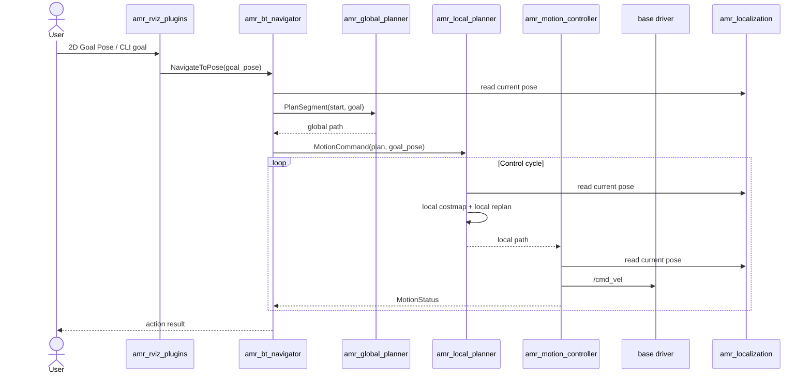

# ros-amr-navigation

Goal-driven ROS 2 AMR navigation stack for occupancy-grid maps, pose estimation, A* planning, local replanning, and velocity control.

## Packages

- `amr_navigation`
  - entry metapackage for building the full stack with `colcon build --packages-up-to amr_navigation`
- `amr_bringup`
  - owns launch files, shared runtime parameters, RViz config, and helper scripts
- `amr_msgs`
  - shared actions, services, and messages
- `amr_map_server`
  - publishes the occupancy map and serves `GetMap`
- `amr_localization`
  - estimates the robot pose from `/odom`, `/scan`, and the static map
- `amr_global_planner`
  - computes inflated-grid A* plans for goal requests
- `amr_local_planner`
  - builds a local inflated costmap and replans a short-horizon path
- `amr_motion_controller`
  - tracks the local plan and publishes `/cmd_vel`
- `amr_bt_navigator`
  - accepts `NavigateToPose`, requests a global plan, and dispatches motion commands
- `amr_rviz_plugins`
  - bridges RViz `2D Goal Pose` input to the AMR action server

## Execution Flow



## Bringup

Build the full stack:

```bash
colcon build --packages-up-to amr_navigation
```

Start map, localization, and global planner first:

```bash
ros2 launch amr_bringup localization.launch.py
```

Start navigation execution in another terminal:

```bash
ros2 launch amr_bringup navigation.launch.py
```

Shared runtime parameters live in [amr.yaml](./amr_bringup/params/amr.yaml).

## Interfaces

### Action

- `/amr/navigator/navigate_to_pose`
  - `amr_msgs/action/NavigateToPose`

### Services

- `/amr/map/get`
  - `nav_msgs/srv/GetMap`
- `/amr/global_planner/plan_segment`
  - `amr_msgs/srv/PlanSegment`
- `/amr/global_planner/plan_route`
  - `amr_msgs/srv/PlanRoute`

### Topics

- `/amr/map/data`
  - `nav_msgs/msg/OccupancyGrid`
- `/amr/costmap/global`
  - `nav_msgs/msg/OccupancyGrid`
- `/amr/costmap/local`
  - `nav_msgs/msg/OccupancyGrid`
- `/amr/localization/pose`
  - `geometry_msgs/msg/PoseStamped`
- `/amr/localization/odometry`
  - `nav_msgs/msg/Odometry`
- `/amr/planner/global`
  - `nav_msgs/msg/Path`
- `/amr/planner/local`
  - `nav_msgs/msg/Path`
- `/amr/motion/command`
  - `amr_msgs/msg/MotionCommand`
- `/amr/motion/status`
  - `amr_msgs/msg/MotionStatus`
- `/cmd_vel`
  - `geometry_msgs/msg/Twist`

## Notes

- the current stack is an MVP-focused custom navigation pipeline
- `amr_localization` is AMCL-lite rather than a full Nav2-compatible AMCL replacement
- both global and local planning now operate on inflated occupancy data
- RViz `2D Goal Pose` can be sent directly to the action server through `amr_rviz_plugins`
