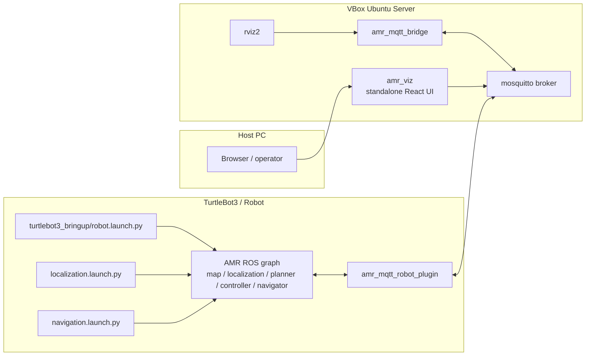

# ros-amr-navigation

Custom ROS 2 Humble AMR navigation stack with robot-side navigation runtime and
MQTT-based cross-machine mirroring for remote monitoring and command flow.

## Current Architecture



## Deployment Direction

- robot-side ROS keeps the high-rate navigation loop local
- MQTT is the only cross-machine transport between robot and VBox
- VBox reconstructs a mirrored ROS graph for RViz, monitoring, and command emit
- `amr_viz` is now a standalone React + MQTT web app

This split exists to reduce DDS traffic across the VM boundary and avoid the
`ksoftirqd` and bridged-adapter load seen with direct cross-machine ROS usage.

## Main Packages

- `amr_navigation`
  - metapackage for the full stack
- `amr_bringup`
  - launch files, shared parameters, and RViz configuration
- `amr_msgs`
  - shared AMR actions, services, and messages
- `amr_map_server`
  - static map server and mapping-mode support
- `amr_localization`
  - pose estimation and `map -> odom`
- `amr_obstacle_detection`
  - scan-based obstacle reporting
- `amr_costmap_server`
  - global/local costmap generation
- `amr_global_planner`
  - A* global planning
- `amr_local_planner`
  - local replanning and escape behavior
- `amr_motion_controller`
  - local plan tracking to `/cmd_vel`
- `amr_bt_navigator`
  - goal execution and orchestration
- `amr_lifecycle_manager`
  - managed bringup sequencing
- `amr_rviz_plugins`
  - local RViz goal bridge utilities
- `amr_mqtt_robot_plugin`
  - robot-side ROS <-> MQTT mirror and command handler
- `amr_mqtt_bridge`
  - VBox-side MQTT <-> ROS mirror and command emitter
- `amr_viz`
  - standalone React + MQTT visualization app

## Runtime Roles

- TurtleBot3 / robot
  - `turtlebot3_bringup/robot.launch.py`
  - `localization.launch.py`
  - `navigation.launch.py`
  - `amr_mqtt_robot_plugin`
- VBox Ubuntu server
  - `mosquitto`
  - `amr_mqtt_bridge`
  - `rviz2`
- Host PC
  - browser running `amr_viz`

## MQTT Split

`amr_mqtt_robot_plugin` handles:

- ROS -> MQTT raw mirroring for robot and navigation telemetry
- MQTT -> ROS forwarding for robot actuation and feature commands
- local ROS service/action dispatch with MQTT ACK responses
- raw ROS feedback/status mirroring for navigation action monitoring

`amr_mqtt_bridge` handles:

- MQTT -> ROS reconstruction on VBox for RViz and monitoring
- ROS -> MQTT command emission from VBox-side inputs such as RViz goal,
  initial pose, and `/cmd_vel`
- mirrored feedback/status republish into the VBox ROS graph

`amr_viz` handles:

- browser-side MQTT over WebSocket connection
- visualization using modeled MQTT topics on `amr/viz/telemetry/*`
- operator command publish for goal and initial pose

## Shared Parameters

Most wiring lives in:

- [`amr_bringup/params/amr.yaml`](/home/reidlo/ws/src/ros-amr-navigation/amr_bringup/params/amr.yaml)

Most important sections:

- `/amr/mqtt_bridge`
- `/amr/mqtt_robot_plugin`
- localization / planner / controller / navigator parameters

## Entry Points

Robot-side total bringup:

```bash
ros2 launch amr_bringup turtlebot3.launch.py
```

VBox-side MQTT mirror:

```bash
ros2 launch amr_mqtt_bridge amr_mqtt_bridge.launch.py
```

Robot-side MQTT plugin only:

```bash
ros2 launch amr_mqtt_robot_plugin amr_mqtt_robot_plugin.launch.py params_file:=/path/to/amr.yaml
```

## Dependencies

Required system packages for the MQTT path:

```bash
sudo apt install -y libpaho-mqtt-dev mosquitto mosquitto-clients
```

Typical workspace build:

```bash
colcon build --packages-up-to amr_navigation
```

Frontend setup:

```bash
cd amr_viz
npm install
npm run dev
```

## Notes

- topic mirror uses raw ROS serialization for transport-sensitive paths
- MQTT explorer tools will show unreadable bytes for raw mirrored topics
- `robot_description`, `map`, `costmap`, and `tf_static` rely on QoS settings
  that preserve late-subscriber behavior on the VBox side
