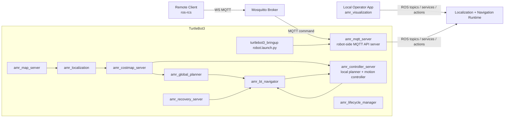

# ROS AMR Navigation

ROS 2 Humble based AMR navigation stack for TurtleBot3 Burger.


Current `0.17.x` direction:
- TurtleBot3 hardware internalization is the top-priority track.
- `amr_bringup/launch/turtlebot3.launch.py` is the AMR-owned robot-side hardware entrypoint.
- `amr_bringup/launch/navigation.launch.py` remains the remote-PC navigation/runtime entrypoint.
- `amr_visualization` starts the in-repo ROS-native Qt6 operator app lane.
- `amr_mqtt_server` remains available for remote-client telemetry and command bridging.
- the external `ros-rcs` app remains a separate remote-client reference:
  - `https://github.com/reidlo5135/ros-rcs`
- Recovery and decision flow follow a Nav2-like split:
  - `amr_bt_navigator` decides
  - planner / controller / recovery packages execute
- `0.15.x` remains the frozen runtime-hardening interpretation baseline.
- `0.16.x` closes the local-escape-first recovery policy, corridor/doorway blocked-state
  tuning pass, and the first in-repo `amr_visualization` operator lane.
- `0.17.x` establishes the first AMR-owned TurtleBot3 hardware layer:
  - `amr_bringup`-owned base driver boundary
  - `amr_bringup`-owned LiDAR driver boundary
  - `amr_bringup`-owned description ownership
  - explicit split between robot-side hardware and remote-PC AMR runtime

## Architecture



## Active Packages

- `amr_bringup`: central launch files, `amr.yaml`, robot-side hardware drivers, and AMR-owned TB3 URDF
- `amr_bt_navigator`: BT-based goal orchestration and recovery decisions
- `amr_controller_server`: local planner and motion controller lifecycle nodes
- `amr_costmap_server`: static global costmap + scan-based dynamic local costmap
- `amr_global_planner`: A* planner on the global costmap
- `amr_localization`: localization and `map -> odom`
- `amr_map_server`: official-map lifecycle, evaluation, and save/freeze services
- `amr_mqtt_server`: robot-side MQTT API server
- `amr_msgs`: custom messages, services, and actions
- `amr_rviz`: dedicated RViz profiles plus RViz-to-action bridge tooling
- `amr_visualization`: ROS-native Qt6 operator visualization app
- `amr_runtime_observation`: runtime summary and event aggregation for navigation state
- `amr_navigation`: metapackage
- `amr_recovery_server`: wait / backup / spin recovery command generation
## Removed Packages

These packages are no longer part of the active stack:
- `amr_obstacle_detection`
- `amr_rviz_plugins`
- the old server-side `amr_mqtt_bridge`
- `amr_mqtt_robot_plugin` as a separate package name
- `amr_viz` in this repository

## MQTT Model

Robot-side `amr_mqtt_server` publishes:
- legacy ROS-oriented data streams on `/<root>/<robot_id>/telemetry/*`
- control and result topics on `/<root>/<robot_id>/<domain>/<channel>`

The external `ros-rcs` desktop client consumes:
- `/amr/burger1/navigation/feedback`
- `/amr/burger1/navigation/status`
- `/amr/burger1/navigation/result`
- `/amr/burger1/pose/result`
- `/amr/burger1/map/result`
- selected legacy data streams while the heavy data plane is being refactored

Commands are sent on:
- `/amr/burger1/navigation/command`
- `/amr/burger1/navigation/cancel`
- `/amr/burger1/pose/set`

Single-goal navigation also uses `/amr/burger1/navigation/command` with a one-element `goal_poses` array.

## Launch

RPi4 robot-side AMR-owned TurtleBot3 hardware bringup:

```bash
ros2 launch amr_bringup turtlebot3.launch.py
```

Legacy external TurtleBot3 compatibility path:

```bash
ros2 launch amr_bringup turtlebot3_external.launch.py
```

Remote-PC AMR navigation/runtime bringup:

```bash
ros2 launch amr_bringup navigation.launch.py
```

This launch is the remote-PC navigation/runtime entrypoint. It does not start TurtleBot3
hardware, `turtlebot3_bringup`, `robot_state_publisher`, or AMR robot driver nodes; run hardware
bringup separately through external TB3 bringup or a robot-side AMR launch.

When using the existing TurtleBot3 bringup separately, keep the structure split across the robot
hardware bringup and the AMR navigation runtime:

```bash
ros2 launch turtlebot3_bringup robot.launch.py
ros2 launch amr_bringup navigation.launch.py
```

The MQTT bridge is disabled by default. Enable it only for MQTT/remote-client workflows:

```bash
ros2 launch amr_bringup navigation.launch.py use_mqtt_server:=true
```

RViz-based local operator test console:

```bash
ros2 launch amr_rviz rviz.launch.py
```

ROS-native Qt6 operator visualization app:

```bash
ros2 launch amr_visualization amr_visualization.launch.py
```

`amr_visualization` subscribes to the static map, pose, paths, and runtime status by default.
Global/local costmap layers are opt-in from the UI because full costmap streams can be heavy on
TurtleBot3-class hardware.

## Structured Logging

Runtime decision logs use the `AMR_LOG` prefix and `key=value` fields. The schema is documented in
[docs/logging/LOG_SCHEMA.md](docs/logging/LOG_SCHEMA.md). Cross-package state summaries and events
remain owned by `amr_runtime_observation`; other packages log only decisions and outcomes in their
own responsibility area.

Common fields:

- `schema=v1`
- `component=<package_role>`
- `event=<event_name>`

Useful event families:

- controller: `tracking_state`, `tracking_heading_debug`, `tracking_frame_mismatch`, `local_path_quality`, `cmd_quality`, `goal_state`, `target_jump_detected`, `local_blocked_state`
- navigator: `goal_received`, `bt_phase_transition`, `recovery_decision`, `recovery_started`, `recovery_finished`
- planner/recovery: `plan_requested`, `plan_succeeded`, `plan_failed`, `recovery_plan_selected`
- observation: `runtime_summary`, `runtime_event`

Structured logging defaults are configured in [amr_bringup/params/amr.yaml](amr_bringup/params/amr.yaml)
under each package's `logging` section.

## Field Debug Scripts

Field scripts live in [scripts](scripts). They share `scripts/amr_logging_env.sh`, which prepares ROS 2
Humble, the local workspace overlay, log directories, bag directories, and a run id.

Common commands:

```bash
scripts/run_navigation_nohup.sh
scripts/run_turtlebot3_nohup.sh
scripts/record_nav_bag_light.sh
scripts/watch_amr_logs.sh --event recovery_decision
scripts/extract_nav_quality.sh --output /tmp/nav_quality.tsv
scripts/stop_nohup_process.sh --label all
```

See [scripts/README.md](scripts/README.md) for options and environment overrides.

## Rosbag2 Recording Profiles

Rosbag profiles are documented in [docs/logging/ROSBAG_PROFILES.md](docs/logging/ROSBAG_PROFILES.md).

| Profile | Script | Use |
| --- | --- | --- |
| `light` | `scripts/record_nav_bag_light.sh` | Repeated navigation quality tests without heavy scan/TF/grid capture |
| `debug` | `scripts/record_nav_bag_debug.sh` | Planner/controller/costmap diagnosis with paths, local costmap, scan, odometry, and TF |
| `full` | `scripts/record_nav_bag_full.sh` | Short targeted all-topic captures |

## Navigation Quality Debugging Workflow

1. Run navigation with `scripts/run_navigation_nohup.sh`.
2. Record a light bag with `scripts/record_nav_bag_light.sh`.
3. Test the same start pose and goal three times.
4. Check recovery entry with `scripts/watch_amr_logs.sh --event recovery_decision`.
5. Extract `goal_state`, `cmd_quality`, `tracking_state`, `tracking_heading_debug`, and `local_path_quality` with `scripts/extract_nav_quality.sh`.
6. Compare `recovery_count`, `cmd_ang_sign_flip_count`, `output_ang_sign_flip_count`, `target_jump_m`, and goal approach phase changes before and after modifications.

If RViz shows global/local plans but the robot drives straight, inspect these `AMR_LOG` fields first:

- `target_idx`
- `selected_idx`
- `target_dist_m`
- `heading_err_rad`
- `cmd_ang`
- `pose_frame`
- `plan_frame`
- `selection_reason`

If the robot follows the plan but wags left/right on a visually straight segment, inspect these fields next:

- `rejoin`
- `rejoin_context_active`
- `straight_segment`
- `path_curvature_score`
- `lateral_error_m`
- `heading_error_raw_rad`
- `heading_error_filtered_rad`
- `steering_deadband_active`
- `steering_hysteresis_state`
- `cmd_ang_sign_flip_count`
- `output_ang_sign_flip_count`
- `local_path_quality.raw_path_points`
- `local_path_quality.simplified_path_points`
- `local_path_quality.refined_path_points`
- `local_path_quality.line_of_sight_simplified`
- `local_path_quality.collinear_pruned_count`
- `local_path_quality.collision_check_passed`

Normal straight tracking should read as `phase=tracking`, `rejoin=false`,
`rejoin_context_active=false`, `straight_segment=true`, and near-zero `cmd_ang` / `output_ang`.
`rejoin=true` is reserved for bounded path return after recovery, escape, or a large tracking target reacquisition.
If `straight_segment=false` while the RViz path looks straight, compare visual straightness with the
actual local plan geometry in `local_path_quality`; high `path_curvature_score` means the controller
is following stair-stepped local points.
For straight-line tracking tests that should ignore final yaw, set
`/amr/motion_controller.goal_checker.ignore_yaw: true`; this only disables final heading alignment
for that test configuration.

Use the `nav_quality_summary` row from `scripts/extract_nav_quality.sh` to compare `cmd_ang_abs_avg`, `output_ang_abs_avg`, and sign flip counts before and after tuning.

## Hardware Boundary

The AMR-facing hardware contract remains:

- `/cmd_vel`
- `/odom`
- `/imu`
- `/scan`
- `/joint_states`
- `/tf`
- `/tf_static`
- `/robot_description`

Frame convention:

- `map`
- `odom`
- `base_footprint`
- `base_link`
- `base_scan`
- `imu_link`

The new AMR-owned hardware path is intentionally still incremental. The current pass adds the
launch/package/transport/protocol boundaries and node shells inside `amr_bringup`, but it does not
claim production-safe OpenCR or LDS packet parity yet.

The ROS-native local operator UI lives in `amr_visualization`. The external `ros-rcs`
line remains useful as a separate remote-client reference.

## Build

```bash
colcon build --packages-select \
  amr_msgs \
  amr_map_server \
  amr_localization \
  amr_costmap_server \
  amr_global_planner \
  amr_controller_server \
  amr_recovery_server \
  amr_bt_navigator \
  amr_runtime_observation \
  amr_lifecycle_manager \
  amr_mqtt_server \
  amr_rviz \
  amr_visualization \
  amr_bringup \
  amr_navigation
```

## QoS Reference

### `turtlebot3_bringup`

| Interface | Kind | QoS | Notes |
| --- | --- | --- | --- |
| `/scan` | topic | `SensorDataQoS` (`keep_last`, `best_effort`, `volatile`) | LDS lidar stream; AMR consumers use `SensorDataQoS` |
| `/odom` | topic | `SystemDefaultsQoS` / reliable-default | diff-drive odometry from `turtlebot3_node` |
| `/imu` | topic | `SensorDataQoS` expectation | IMU is enabled in TB3 diff-drive config (`use_imu: true`); AMR telemetry treats it as sensor-data profile |
| `/cmd_vel` | topic | reliable-default | velocity command ingress to robot base |
| `/tf` | topic | reliable-default, `volatile` | dynamic transform stream |
| `/tf_static` | topic | reliable-default, `transient_local` | static transforms must remain latched/persistent |

### `amr_navigation`

| Interface | Kind | QoS | Owner / Notes |
| --- | --- | --- | --- |
| `/amr/map/data` | topic | `keep_last(1)`, `reliable`, `transient_local` | official map from `amr_map_server`; late joiners must receive last map |
| `/amr/localization/initial_pose` | topic | `SystemDefaultsQoS` | initial pose ingress/echo between RViz, lifecycle manager, localization |
| `/amr/localization/pose` | topic | `SystemDefaultsQoS` | estimated robot pose from `amr_localization` |
| `/amr/localization/odometry` | topic | `SystemDefaultsQoS` | localization-derived odometry output |
| `/amr/costmap/global` | topic | `keep_last(1)`, `reliable`, `transient_local` | global costmap from `amr_costmap_server` |
| `/amr/costmap/local` | topic | `keep_last(1)`, `reliable`, `transient_local` | local costmap from `amr_costmap_server` |
| `/amr/planner/global` | topic | `SystemDefaultsQoS` | global path from `amr_global_planner` |
| `/amr/planner/local` | topic | `SystemDefaultsQoS` | local path from `amr/local_planner` |
| `/amr/planner/local_status` | topic | `SystemDefaultsQoS` | local planner status/blocked context |
| `/amr/motion/command` | topic | `SystemDefaultsQoS` | navigator/recovery -> local planner / motion controller command lane |
| `/amr/motion/status` | topic | `SystemDefaultsQoS` | motion controller runtime status |
| `/amr/observation/runtime/summary` | topic | `SystemDefaultsQoS` | operator-facing condensed runtime summary |
| `/amr/observation/runtime/events` | topic | `SystemDefaultsQoS` | operator-facing runtime event stream |
| `/amr/rviz/goal` | topic | reliable-default, `volatile` | RViz 2D Goal Pose ingress; bridged into `NavigateToPose` |
| `/amr/rviz/goals` | topic | reliable-default, `volatile` | reserved RViz/operator multi-goal ingress; bridged into `NavigateToPoses` |
| `/amr/global_planner/plan_segment` | service | n/a | segment planning service |
| `/amr/global_planner/plan_route` | service | n/a | route planning service |
| `/amr/local_planner/plan_local_escape` | service | n/a | local escape planning service |
| `/amr/costmap_server/clear_costmap` | service | n/a | explicit costmap clear request |
| `/amr/recovery_server/plan_recovery` | service | n/a | recovery command generation |
| `/amr/map_server/get_map` | service | n/a | retrieve current official map |
| `/amr/map_server/freeze_temporary_map` | service | n/a | freeze temporary SLAM map |
| `/amr/map_server/evaluate_temporary_map` | service | n/a | temporary map quality evaluation |
| `/amr/map_server/save_temporary_map` | service | n/a | save promoted temporary map |
| `/amr/navigator/navigate_to_pose` | action | action transport defaults | single-goal navigation |
| `/amr/navigator/navigate_to_poses` | action | action transport defaults | waypoint route navigation |
| `/amr/navigator/navigate_to_poses/_action/feedback` | topic | `SystemDefaultsQoS` | consumed by `amr_runtime_observation` |
| `/amr/navigator/navigate_to_poses/_action/status` | topic | `SystemDefaultsQoS` | consumed by `amr_runtime_observation` and `amr_mqtt_server` |

Notes:

- In this repository, `SensorDataQoS` is intentionally used for raw sensor feeds such as `/scan`, and should remain the default expectation for high-rate hardware topics.
- `transient_local + reliable` is reserved for map-like latched data that late subscribers must immediately receive.
- Most internal `/amr/**` status/plan/command lanes currently use `SystemDefaultsQoS`; keep publisher/subscriber defaults aligned unless there is a concrete reason to specialize them.
- `amr_runtime_observation` currently consumes `NavigateToPoses` action feedback/status for route-level observation; single-goal navigation is still visible indirectly through motion and planner status lanes.
