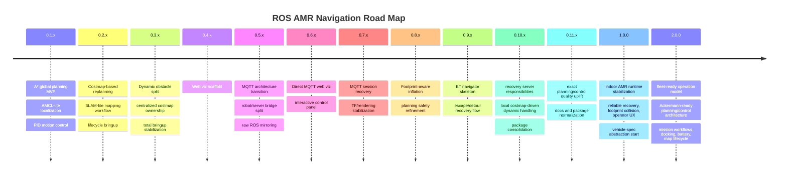

# ROAD MAP

## Product Direction

This project is building toward a self-owned indoor AMR stack for TurtleBot3-class robots with:
- on-robot localization, planning, control, recovery, and MQTT telemetry
- browser-based operations and visualization
- clear package responsibilities across mapping, navigation, recovery, and operator tooling
- predictable behavior in narrow corridors, dynamic obstacles, and long-running indoor operation

## Version Journey

| Version | Focus | Result |
| --- | --- | --- |
| `0.1.x` | MVP navigation core | A* global planning, AMCL-lite localization, PID-based motion loop, first runtime bringup |
| `0.2.x` | Mapping and replanning | costmap-based replanning, RViz goal bridge, SLAM-lite mapping workflow, lifecycle management |
| `0.3.x` | Obstacle/costmap ownership | dynamic obstacle split, centralized costmap ownership, total bringup refinement |
| `0.4.x` | Web visualization start | `amr_viz` web scaffold and runtime scripts |
| `0.5.x` | MQTT-first architecture | ROS-MQTT transport, command bridge, robot/server role split, raw ROS serialization |
| `0.6.x` | Direct web operations | direct MQTT web visualization, web control panel, reduced visualization latency |
| `0.7.x` | Viz/operator polish | interactive map control, URDF-based rendering attempts, MQTT reconnect hardening |
| `0.8.x` | Planning safety | footprint-aware inflation and planner safety tuning |
| `0.9.x` | Behavior-based orchestration | BT navigator skeleton, escape/detour recovery flow, better goal/result reporting |
| `0.10.x` | Runtime role cleanup | recovery server responsibilities, local costmap-driven dynamic handling, unused package removal |
| `0.11.x` | Consolidation and quality uplift | package normalization, include hygiene, documentation refresh, next-stage planner/controller quality work |

## 0.11.x Focus

- exact footprint collision instead of footprint-radius approximation
- stronger local costmap authority for blocked/free judgments
- controller/progress/goal checker separation
- recovery behavior tuning for narrow-corridor indoor operation
- operator-facing diagnostics that explain `running`, `recovering`, `stopped`, `aborted`, and `reached`

## Toward 1.0.0

- reliable indoor point-to-point navigation in narrow corridors
- exact footprint-aware planning and collision checks
- stable final-approach behavior with low oscillation near goal
- recovery stack with wait / backup / spin / replan / clear-costmap policies
- MQTT/web operations that remain responsive during continuous motion
- map lifecycle that supports create, freeze, save, load, and reuse without manual recovery
- vehicle-spec parameter model introduction
  - `vehicle.type: diff_drive | ackermann | oht`
  - shared `footprint`, speed/acceleration limits, and per-vehicle geometry fields
  - central `amr.yaml` vehicle section that all planning/control packages consume

## Toward 2.0.0

- Ackermann support as the next realistic vehicle-class expansion
  - `motion_controller` must stop assuming pure `linear.x + angular.z` diff-drive control
  - controller core should produce vehicle-neutral targets such as speed / heading / curvature
  - vehicle adapters should convert those targets into diff-drive or Ackermann ROS commands
  - local planner should branch by vehicle type instead of forcing one geometry model on all vehicles
  - global planning should add path smoothing first, then consider curvature-constrained planning if needed
- OHT support only after Ackermann architecture is mature
  - reuse the same vehicle-spec / adapter / planner split
  - extend to rail-like or guideway-like constraints only after the generic vehicle model is stable
- battery-aware operation and return-home behavior
- docking / homing workflow
- simple mission model such as saved destinations and route execution
- map/version lifecycle for deployment to multiple robots or sites
- long-duration stability, observability, and operator tooling suitable for field use

## Core Technical Tracks

### Planning and Costmaps

- exact polygon footprint collision shared by costmap, global planner, and local planner
- stronger local costmap semantics for dynamic obstacles detected from live scan
- cleaner separation between global detour and local escape
- corridor and doorway behavior tuning without over-inflation
- vehicle-aware planning path
  - keep global A* as the first common planner
  - add path smoothing before replacing the global planner
  - make local planner responsible for vehicle-specific feasibility
  - evaluate Hybrid A* / state-lattice only after Ackermann local control and collision semantics are stable

### Control and Recovery

- progress checker and goal checker separation inside `amr_motion_controller`
- smoother final heading alignment and stop behavior
- deterministic recovery sequencing across wait / backup / spin / replan
- fewer oscillations during recovery exit and global path rejoin
- vehicle-neutral control core
  - split controller logic into shared tracking core + vehicle kinematics adapter
  - `DiffDriveAdapter` keeps `/cmd_vel`
  - future `AckermannAdapter` should emit steering-compatible commands
  - OHT or other future vehicle classes should plug into the same abstraction boundary

### Mapping and Localization

- stable `map -> odom -> base_footprint -> base_link` chain
- practical mapping-mode and navigation-mode transition
- better map lifecycle procedures for save/load/freeze/reuse

### MQTT and Operations

- robot-side MQTT transport remains the single telemetry source
- leaner visualization payloads for web consumers
- robust reconnect, retained static data, and low-latency live telemetry
- operator visibility into recovery state, goal state, and planner/controller health
- vehicle-type-aware command transport
  - operator and MQTT command schema should move toward vehicle-neutral motion intent
  - robot-side bridge should translate the common command model into vehicle-specific ROS topics
  - avoid hard-coding `/cmd_vel` as the only long-term motion interface

## Ackermann Expansion Notes

- first target is not OHT but Ackermann-capable indoor navigation
- required order of work:
  1. add vehicle-spec parameters in `amr.yaml`
  2. generalize `amr_motion_controller` into controller core + vehicle adapter
  3. extend `amr_msgs` with vehicle-neutral motion command fields
  4. split `amr_local_planner` by vehicle type or strategy
  5. add global path smoothing for non-diff-drive vehicles
  6. upgrade footprint collision from radius approximation to exact polygon checks
  7. only then consider curvature-constrained global planning
- Ackermann-specific items to remember:
  - wheelbase
  - track width
  - steering limits
  - minimum turning radius
  - reverse policy
  - front/rear overhang
  - swept footprint during turns

### Visualization and UX

- clearer robot model rendering and TF interpretation
- layer-aware debugging for map, costmap, scan, plans, and recovery state
- map-native goal/initial-pose interaction
- stronger status semantics for accepted / running / recovering / aborted / reached

# Daily TODO Memo

## Active Queue

| Date | Detail |
| --- | --- |
| `2026-03-25` | exact footprint collision 완료, local costmap authority 1차 반영, recovery/final approach 1차 안정화 |
| `2026-03-24` | `amr_costmap_server` footprint polygon 고도화, local escaping replan 명확화, `amr_bt_navigator` 실질 BT 책임 강화 |
| `2026-03-23` | `amr_viz` React + MQTT 완전 전환, `amr_mqtt_bridge` 소스 구조 개편 |
| `2026-03-20` | MQTT-first 웹 운영 구조 전환, bridge 패키지 분리, visualization/control/telemetry 기준 재모델링 |
| `2026-03-18` | dynamic obstacle escaping 고도화, custom mapping workflow 확장, global localization 검토 |

## 2026-03-25

- 완료: exact footprint collision 1차 적용
  - `amr_geometry` 공용 geometry 유틸 분리
  - `amr_global_planner`, `amr_local_planner`에 exact polygon collision 반영
  - `amr_viz`에 exact footprint overlay / collision debug layer 추가
- 진행: local costmap authority 강화
  - controller 직접 authority 부여 시 straight case를 해쳐 일단 revert
  - 대신 `amr_local_planner -> LocalPlanStatus -> amr_bt_navigator` 경로로 1차 반영
  - 다음 우선순위는 `LocalPlanStatus`를 decision semantics 중심으로 확장해 planner가 recovery rationale을 먼저 말하게 만드는 것
  - 남은 과제는 recovery 진입 기준을 더 다듬고, corridor에서 false blocked를 줄이는 것
- 진행: recovery / final approach 안정화
  - stale status 기반 recovery 오진입 방지
  - goal 근처 local plan empty로 인한 false recover/abort 완화
  - `amr_viz` Goal 상태를 `Running / Recovering / Aborted / Reached` 등으로 세분화
  - 다만 이 항목의 추가 튜닝은 BT 하드코딩보다 planner decision semantics 확장 이후에 진행
  - 남은 과제는 final approach oscillation과 recovery primitive 튜닝 정리

## 2026-03-24

- `amr_costmap_server` footprint polygon 고도화
  - 현재는 footprint polygon을 circumscribed radius로 환산해 inflation에 반영하는 1차 구조
  - polygon 자체를 orientation-aware collision check에 직접 반영하도록 확장 필요
  - `global/local planner`가 동일한 footprint 해석을 공유하도록 책임 경계 정리
- local escaping replan 명확화
  - 현재는 dynamic obstacle을 미리 보고 replan은 하지만 좌/우 oscillation이 심함
  - escape 진입 조건, 유지 조건, 종료 조건을 명확히 나눌 필요 있음
  - obstacle release 전 기존 corridor 복귀를 제한하는 hysteresis와 확실한 판단 기준 추가
- `amr_bt_navigator` 현업 표준 BT 적용
  - 현재의 형식적 BT 사용에서 벗어나 실제 의사결정 트리로 재구성
  - 동적 장애물 판단과 recovery 선택은 반드시 `amr_bt_navigator`가 담당
  - 각 feature package는 판단이 아닌 수행 역할만 하도록 책임 분리
  - local escaping replan 정책과 직접 연계

## 2026-03-23

- `amr_viz` React + MQTT 완전 전환
  - 현재 과도기적 viz/bridge 흔적 정리
  - browser 기반 운영 화면을 MQTT client 전제로 재구성
  - `goal`, `status`, `feedback`, `map`, `path`, `costmap` 확인 흐름 재정리
- `amr_mqtt_bridge` 소스 구조 개편
  - `rcl` 관련 로직과 `MQTT` 관련 로직을 별도 `.h/.c` 파일로 분리
  - 예시: `node.h`, `node.c`, `mqtt.h`, `mqtt.c`
  - 직렬화/역직렬화, topic routing, ROS interface init/fini 책임도 파일 단위로 분리

## 2026-03-20

- `amr_viz`를 순수 React Web 프로젝트로 전환
  - Electron 관련 shell / 실행 경로 제거
  - host PC 브라우저 접속 기준 운영 viz 구조로 정리
  - visualization UI와 ROS bridge 책임 완전 분리
- `amr_mqtt_bridge` 신규 ROS 2 패키지 추가
  - `amr_viz` 내부 bridge 구현을 별도 패키지로 분리
  - viz 전용이 아닌 범용 ROS <-> MQTT bridge 역할로 설계
  - 향후 다른 UI / 운영 툴 / 외부 시스템에서도 재사용 가능하도록 패키지 경계 정의
- `amr_navigation` 인터페이스를 MQTT 기준으로 재모델링
  - 기존 ROS topic / service / action을 그대로 노출하지 말고 필요한 데이터만 선별
  - visualization / control / telemetry 용 메시지 스키마 별도 정의
  - publish / subscribe 채널 구조, topic naming, QoS 대응 전략 설계
- React Web client를 MQTT 기반 통신 구조로 전환
  - WebSocket direct bridge 대신 MQTT client 사용
  - low-latency 상태 갱신, command 송신, initial pose / goal / status 흐름 재정리
  - host browser 렌더링 + VM/Ubuntu Server bridge/hosting 역할 분리 유지
- 성능 고도화 최우선
  - Python bridge 고CPU 문제 제거
  - launch / logging / serialization overhead 최소화
  - 실사용 기준으로 RViz 대비 가벼운 운영 viz 목표 재설정

## 2026-03-18

- dynamic obstacle escaping 고도화
  - 현재 local replan이 escape보다 기존 global plan 복귀를 너무 빨리 시도해 어색한 주행이 발생함
  - 목표 동작은 `dynamic obstacle 감지 -> dynamic inflation 반영 -> global A* detour replan -> local plan은 obstacle release 전까지 escaping 수행 -> detour 경유 후 goal 복귀` 흐름으로 재정의
  - `amr_bt_navigator`가 dynamic obstacle 상황에서 global detour replan을 트리거하고, `amr_local_planner`는 release 조건 전까지 escape-centric local plan을 유지하도록 역할 정리
  - dynamic obstacle이 해제되기 전에는 기존 global corridor로 즉시 재복귀하지 않도록 조건과 hysteresis 추가 검토
- `0.3.1` R&R refactoring continuation
  - `amr_bt_navigator`가 obstacle report를 바탕으로 wait / local replan / global replan / recovery를 실제로 판단하도록 확장
  - `amr_motion_controller`를 path tracking + 최종 근접 safety gate만 남기는 방향으로 추가 축소
  - `amr_global_planner`, `amr_local_planner`에서 남아 있는 legacy self-costmap 가정 완전 제거
  - `amr_costmap_server`를 기준으로 fixed/dynamic obstacle layer 정책 정교화
- `amr_motion_controller` local plan tracking issue 해결
  - local plan 마지막 점만 따라가며 corner cutting 하는 현상 수정
  - 현재 위치 기준 nearest point 이후의 lookahead target 추종 방식 적용
  - 실제 odom 궤적이 local/global costmap clearance를 유지하도록 보정
- obstacle 감지 시 local plan 재계산 및 회피 주행 구현
  - `obstacle_detected` 발생 시 단순 정지에서 끝나지 않도록 local replan 흐름 추가
  - `정지 -> local recompute -> 재시도` 최소 동작 먼저 구현
  - 필요 시 회피 실패/재시도 횟수 제한 및 fallback 동작 정의
- custom mapping workflow 확장
  - `mapping mode -> static navigation mode` 전환 절차 설계
  - bootstrap mapping용 local scan matching 파라미터 튜닝
  - mapping-mode corrected `map -> odom` TF 안정화 및 시각 정합성 검증
  - map quality 기준값 튜닝 및 실제 환경별 threshold 표준화
  - auto-save 이후 자동 `navigation mode` 전환 절차 정리
  - 저장된 official map을 바로 navigation launch에 재사용하는 절차 정리
  - temporary map 기반 localization correction은 mapping 초기 구간 이후에만 붙는 구조 검토
- 최초 환경 자동 탐색 전략 정리
  - teleop 없이도 미지 환경을 훑으며 map을 쌓는 탐색 주행 전략 검토
  - 벽 따라가기, 회전-전진, 장애물 회피 기반 탐색 방식 비교
  - coverage보다 "충돌 없이 공간을 훑으며 map 생성"을 우선 목표로 정의
- global localization 구현 검토
  - 수동 `initial_pose` 없이 시작 가능한 global localization 흐름 설계
  - map 전체 particle 분포 초기화 및 scan 기반 수렴 절차 검토
  - kidnapped 상황 대응용 relocalization 조건과 fallback 동작 정의
