# ROAD MAP

```mermaid
timeline
    title ROS AMR Navigation Road Map
    0.1.x : A* global planning MVP
          : AMCL-lite localization
          : PID motion control
    0.2.x : Costmap-based replanning
          : SLAM-lite mapping workflow
          : lifecycle bringup
    0.3.x : Dynamic obstacle split
          : centralized costmap ownership
          : total bringup stabilization
    0.4.x : Web viz scaffold
    0.5.x : MQTT architecture transition
          : robot/server bridge split
          : raw ROS mirroring
    0.6.x : Direct MQTT web viz
          : interactive control panel
    0.7.x : MQTT session recovery
          : TF/rendering stabilization
    0.8.x : Footprint-aware inflation
          : planning safety refinement
    0.9.x : BT navigator skeleton
          : escape/detour recovery flow
    0.10.x : recovery server responsibilities
           : local costmap-driven dynamic handling
           : package consolidation
    0.11.x : exact planning/control quality uplift
           : docs and package normalization
    0.12.x : exact footprint navigation baseline
           : richer amr_viz operator console
           : stable 0.12.4 navigation runtime
    0.13.x : ARL / GL experimental track
           : scan-first relocalization attempts
           : deprecated after shared-path regression risk
    0.14.x : mapping-line reboot from 0.12.4
           : amr_slam_mapper introduction
           : raw/refined temp SLAM map workflow
    0.15.x : navigation runtime hardening
           : recovery observability and regression baselines
           : 0.15.9 recovery trigger visibility and structured diagnosis
           : 0.15.10 recovery phase semantics and blocked-context interpretation
           : stable robot-side MQTT/web operator loop
    0.16.x : local escape-first recovery refinement
           : planner-local escape first wiring
           : corridor / doorway blocked-state tuning
           : final-approach stability cleanup
    0.17.x : planner/controller quality uplift
           : path smoothing and blocked semantics refinement
           : recovery exit and path rejoin quality
    0.18.x : live SLAM temp map navigation integration
           : mapping-ready / nav-ready state model
           : map lifecycle and transition cleanup
    0.19.x : multi-robot and deployment readiness
           : MQTT topic / command stability
           : operator diagnostics and long-run operation polish
    1.0.0 : indoor AMR runtime stabilization
          : reliable recovery, footprint collision, operator UX
          : vehicle-spec abstraction start
    2.0.0 : fleet-ready operation model
          : Ackermann-ready planning/control architecture
          : mission workflows, docking, battery, map lifecycle
```

## Product Direction

This project is building toward a self-owned indoor AMR stack for TurtleBot3-class robots with:
- on-robot localization, planning, control, recovery, and MQTT telemetry
- browser-based operations and visualization
- clear package responsibilities across mapping, navigation, recovery, and operator tooling
- predictable behavior in narrow corridors, dynamic obstacles, and long-running indoor operation

## 260507

- `amr_light.rviz` test profile did not reproduce the remote-subscriber crash path.
- Current hypothesis:
  `rviz2` / `amr_mqtt_server` full-data remote subscription is the trigger, not bare navigation.

- `amr_rviz` package promotion
  - split the lightweight RViz/operator tooling into a dedicated `amr_rviz` package
  - move the current test RViz profile into the new package as the baseline
  - include an `rviz2` launch entrypoint inside the package

- action-to-topic bridge for RViz operator flow
  - add bridge support for `/amr/navigator/navigate_to_pose`
  - add bridge support for `/amr/navigator/navigate_to_poses`
  - make `2D Goal Pose` usable from RViz without relying on direct action CLI during tests

- RViz UI/UX cleanup
  - improve the current operator layout and interaction flow
  - clean up naming, grouping, and default enabled displays
  - make the profile usable as a real test console instead of a debug scratch file

- RViz display scope expansion
  - keep `raw map`, `TF`, `initial pose`, and `send goal`
  - add `global plan`
  - add `local plan`

- QoS alignment audit
  - unify QoS assumptions between `tb3_bringup`, AMR stack, and RViz consumers
  - explicitly document which topics must remain `SensorDataQoS`, transient local, or reliable

- multi-goal driving quality fix
  - current `NavigateToPoses` behavior appears to treat middle goals too literally for final yaw
  - for middle waypoints, treat them as pass-through poses and derive heading from the upcoming goal
  - avoid the current pattern where the robot rotates to match a middle-goal yaw, then turns back and resumes forward motion

## Version Journey

| Version | Focus | Result |
| --- | --- | --- |
| `0.1.x` | MVP navigation core | A* global planning, AMCL-lite localization, PID-based motion loop, first runtime bringup |
| `0.2.x` | Mapping and replanning | costmap-based replanning, RViz goal bridge, SLAM-lite mapping workflow, lifecycle management |
| `0.3.x` | Obstacle/costmap ownership | dynamic obstacle split, centralized costmap ownership, total bringup refinement |
| `0.4.x` | Web visualization start | `amr_viz` web scaffold and runtime scripts |
| `0.5.x` | MQTT-first architecture | ROS-MQTT transport, command bridge, robot/server role split, raw ROS serialization |
| `0.6.x` | Direct web operations | direct MQTT web visualization, web control panel, reduced visualization latency |
| `0.7.x` | Viz/operator polish | interactive map control, URDF-based rendering attempts, MQTT reconnect hardening |
| `0.8.x` | Planning safety | footprint-aware inflation and planner safety tuning |
| `0.9.x` | Behavior-based orchestration | BT navigator skeleton, escape/detour recovery flow, better goal/result reporting |
| `0.10.x` | Runtime role cleanup | recovery server responsibilities, local costmap-driven dynamic handling, unused package removal |
| `0.11.x` | Consolidation and quality uplift | package normalization, include hygiene, documentation refresh, next-stage planner/controller quality work |
| `0.12.x` | Stable navigation baseline | exact footprint collision, final-approach/recovery cleanup, richer `amr_viz`, MQTT battery/ping/goal visibility, `0.12.4` stable operator baseline |
| `0.13.x` | ARL / GL experimental branch | active relocalization, scan-first candidates, ARL probing, candidate viz, then deprecated after shared-path regression risk |
| `0.14.x` | Mapping line reboot | reset mainline to `0.12.4`, add `amr_slam_mapper`, split mapping mode from nav mode, raw/refined temp SLAM maps, mapping observability and save flows |
| `0.15.x` | Runtime hardening | scenario-based regression baselines, clearer recovery diagnostics, robot-side MQTT/web operation stabilization, safer operational baseline after the mapping reboot |
| `0.16.x` | Recovery refinement | local escape-first recovery flow, narrower-corridor tuning, cleaner blocked semantics, reduced false recovery entry near doors and goal approach |
| `0.17.x` | Planner/controller quality | global path smoothing, motion-controller approach quality, recovery-exit stability, lower oscillation during path rejoin and final heading alignment |
| `0.18.x` | Live SLAM navigation bridge | temporary refined map consumption by nav runtime, `ready_for_nav` vs `ready_for_save` mapping criteria, smoother mapping-to-navigation transition without static-save-first workflow |
| `0.19.x` | Operations and deployment readiness | robot-id / multi-robot topic discipline, stronger reconnect and retained-data behavior, richer operator diagnostics, longer unattended runtime confidence before `1.0.0` |

## 0.11.x Focus

- exact footprint collision instead of footprint-radius approximation
- stronger local costmap authority for blocked/free judgments
- controller/progress/goal checker separation
- recovery behavior tuning for narrow-corridor indoor operation
- operator-facing diagnostics that explain `running`, `recovering`, `stopped`, `aborted`, and `reached`

## 0.12.x Recap

- re-established the navigation stack around exact footprint collision instead of radius-only safety checks
- improved local planner / motion controller / BT navigator interaction for approach, blocked-state, and recovery sequencing
- expanded `amr_viz` from a simple viewer into the main operator console
  - richer goal lifecycle, collision overlays, battery telemetry, MQTT ping state, cleaner panel layout
  - React app/features modularization and direct MQTT operator flow polish
- ended the line with `0.12.4` as the last clean navigation-first baseline before ARL/GL experiments

## 0.13.x Experimental Notes

- tried to extend the stack toward kidnapped recovery and active relocalization
  - global relocalization
  - scan-first candidate stabilization
  - ARL probing behaviors
  - relocalization candidate visualization
- the direction was technically valuable, but the implementation touched shared startup / localization / BT paths too aggressively
- result:
  - learned that ARL/GL must live as a separate system layer or experimental track
  - `0.13.x` is now considered deprecated as an operational baseline
  - the main AMR line was intentionally reset to `0.12.4` before moving forward

## 0.14.x Recap

- restarted the mainline from the stable `0.12.4` navigation baseline
- introduced `amr_slam_mapper` as a new mapping-focused package instead of overloading `amr_map_server`
- split mapping from navigation more cleanly
  - `mapping_mode:=true` for pure SLAM recording
  - navigation mode kept as the existing stable runtime path
- added pose-graph-oriented temporary SLAM mapping
  - local scan matching
  - keyframes / edges / loop closure attempts
  - graph-based temporary map rebuild
- added mapping observability and workflow support
  - mapping mode in `amr_viz`
  - joystick teleop for mapping
  - map save controls
  - raw / refined temp SLAM map layers
- improved MQTT fleet-readiness on the robot side
  - robot-id-scoped topics
  - simpler topic-header configuration
  - relative map image path resolution fix for YAML-backed map loading

## 0.15.x Frozen Baseline

- post-`0.14.x` runtime is now treated as the frozen navigation-hardening baseline
- recovery reasoning is exposed through the current observation layer
  - planner decision
  - recovery trigger / reason
  - blocked context
  - recovery phase
- robot-side MQTT/web operator loop remains on the `0.15.x` contract while higher-risk
  recovery-policy work moves to `0.16.x`
- recent manual confidence checks include stable dynamic interrupt behavior in the current
  operator flow

## 0.15.x Exit Notes

- `0.15.9` fixed the operator-facing recovery diagnosis boundary
- `0.15.10` fixed the recovery-phase / blocked-context observation boundary
- this line is now frozen so `0.16.x` can change recovery policy without moving the
  interpretation baseline underneath it

## 0.16.x Planned Focus

- move recovery quality from "works in the common case" toward "predictable in tight indoor cases"
- promote local escape into a first-class recovery path before heavier global retries when appropriate
- reduce corridor and doorway false-blocked cases
- stabilize final approach when a goal is close but local obstacle evidence is noisy
- clarify recovery entry / hold / exit conditions so `wait`, `backup`, `spin`, and re-dispatch behave deterministically

## 0.17.x Planned Focus

- improve planner/controller quality after the recovery flow is more trustworthy
- add path smoothing ahead of future non-diff-drive expansion
- refine blocked-state semantics between local planner, motion controller, and BT navigator
- improve recovery exit quality so the robot rejoins the global path without sharp oscillation
- reduce low-speed final heading jitter and stop/start thrash near the goal

## 0.18.x Planned Focus

- connect live SLAM temporary maps to the navigation runtime in a controlled way
- define explicit mapping readiness states instead of treating every temporary map as equally usable
  - `mapping_bootstrap`
  - `ready_for_nav`
  - `ready_for_save`
- evaluate costmap / planner behavior on live refined maps, especially around unknown space and graph correction jumps
- clean up the workflow from mapping mode to navigation mode so operators do not have to rely on ad-hoc manual steps

## 0.19.x Planned Focus

- harden MQTT and operator workflows for longer-running and multi-robot-style deployment
- keep robot identity, topic scoping, and command routing stable under reconnect and robot-id changes
- improve operator diagnostics so `accepted`, `running`, `recovering`, `canceling`, `aborted`, and `reached` are all unambiguous
- tighten deployment-facing behaviors
  - retained static data policy
  - reconnect recovery policy
  - response semantics for command, planner request, and map-save actions

## Immediate Candidate Tracks After 0.14.x

- keep `navigation` and `mapping` as separate operational lanes
  - do not re-mix ARL/GL into the stable nav runtime path
- spend the first post-`0.14.x` cycle on runtime hardening and regression visibility, not on broad new feature branching
- bring local escape and recovery quality to an operationally trustworthy state before widening the planning surface
- evaluate `live SLAM temp map -> costmap/planner` integration only after the current navigation baseline is stable enough to compare against
  - instead of forcing `save static map first -> navigate later`
- continue tightening MQTT robot identity and multi-robot readiness
  - the next higher-level work after AMR is ACS / fleet integration
- improve `amr_slam_mapper` only when the scope is clear
  - scan matcher quality
  - loop descriptor quality
  - graph optimization quality
  - mapping readiness / completion criteria

## Toward 1.0.0

- reliable indoor point-to-point navigation in narrow corridors
- exact footprint-aware planning and collision checks
- stable final-approach behavior with low oscillation near goal
- recovery stack with wait / backup / spin / replan / clear-costmap policies
- MQTT/web operations that remain responsive during continuous motion
- map lifecycle that supports create, freeze, save, load, and reuse without manual recovery
- vehicle-spec parameter model introduction
  - `vehicle.type: diff_drive | ackermann | oht`
  - shared `footprint`, speed/acceleration limits, and per-vehicle geometry fields
  - central `amr.yaml` vehicle section that all planning/control packages consume

## Toward 2.0.0

- Ackermann support as the next realistic vehicle-class expansion
  - `motion_controller` must stop assuming pure `linear.x + angular.z` diff-drive control
  - controller core should produce vehicle-neutral targets such as speed / heading / curvature
  - vehicle adapters should convert those targets into diff-drive or Ackermann ROS commands
  - local planner should branch by vehicle type instead of forcing one geometry model on all vehicles
  - global planning should add path smoothing first, then consider curvature-constrained planning if needed
- OHT support only after Ackermann architecture is mature
  - reuse the same vehicle-spec / adapter / planner split
  - extend to rail-like or guideway-like constraints only after the generic vehicle model is stable
- battery-aware operation and return-home behavior
- docking / homing workflow
- simple mission model such as saved destinations and route execution
- map/version lifecycle for deployment to multiple robots or sites
- long-duration stability, observability, and operator tooling suitable for field use

## Core Technical Tracks

### Planning and Costmaps

- exact polygon footprint collision shared by costmap, global planner, and local planner
- stronger local costmap semantics for dynamic obstacles detected from live scan
- cleaner separation between global detour and local escape
- corridor and doorway behavior tuning without over-inflation
- vehicle-aware planning path
  - keep global A* as the first common planner
  - add path smoothing before replacing the global planner
  - make local planner responsible for vehicle-specific feasibility
  - evaluate Hybrid A* / state-lattice only after Ackermann local control and collision semantics are stable

### Control and Recovery

- progress checker and goal checker separation inside `amr_controller_server`
- smoother final heading alignment and stop behavior
- deterministic recovery sequencing across wait / backup / spin / replan
- fewer oscillations during recovery exit and global path rejoin
- vehicle-neutral control core
  - split controller logic into shared tracking core + vehicle kinematics adapter
  - `DiffDriveAdapter` keeps `/cmd_vel`
  - future `AckermannAdapter` should emit steering-compatible commands
  - OHT or other future vehicle classes should plug into the same abstraction boundary

### Mapping and Localization

- stable `map -> odom -> base_footprint -> base_link` chain
- practical mapping-mode and navigation-mode transition
- better map lifecycle procedures for save/load/freeze/reuse

### MQTT and Operations

- robot-side MQTT transport remains the single telemetry source
- leaner visualization payloads for web consumers
- robust reconnect, retained static data, and low-latency live telemetry
- operator visibility into recovery state, goal state, and planner/controller health
- vehicle-type-aware command transport
  - operator and MQTT command schema should move toward vehicle-neutral motion intent
  - robot-side bridge should translate the common command model into vehicle-specific ROS topics
  - avoid hard-coding `/cmd_vel` as the only long-term motion interface

## Ackermann Expansion Notes

- first target is not OHT but Ackermann-capable indoor navigation
- required order of work:
  1. add vehicle-spec parameters in `amr.yaml`
  2. generalize `amr_controller_server` into controller core + vehicle adapter
  3. extend `amr_msgs` with vehicle-neutral motion command fields
  4. split controller-server local planning by vehicle type or strategy
  5. add global path smoothing for non-diff-drive vehicles
  6. upgrade footprint collision from radius approximation to exact polygon checks
  7. only then consider curvature-constrained global planning
- Ackermann-specific items to remember:
  - wheelbase
  - track width
  - steering limits
  - minimum turning radius
  - reverse policy
  - front/rear overhang
  - swept footprint during turns

### Visualization and UX

- clearer robot model rendering and TF interpretation
- layer-aware debugging for map, costmap, scan, plans, and recovery state
- map-native goal/initial-pose interaction
- stronger status semantics for accepted / running / recovering / aborted / reached

# Daily TODO Memo

## Active Queue

| Date | Detail |
| --- | --- |
| `2026-04-30` | `0.15.x` freeze: `0.15.10`을 runtime-hardening 기준선으로 동결, recovery observation/dynamic interrupt 확인 후 다음 구현 축을 `0.16.x`로 이관 |
| `2026-04-30` | `0.15.10` recovery phase 상태 고정, motion controller는 BT 실행 책임만 유지, observation의 blocked context / recovery phase schema 추가 |
| `2026-04-30` | `0.15.9` 기준선 반영, recovery trigger/reason 가시성 강화, runtime observation summary/event schema 정리, `local_escape-first` 복구 흐름은 다음 패치 라인으로 이관 |
| `2026-04-14` | AMR 기본 goal semantics 재정의, `x/y` 우선 도달 정책, goal yaw optional화, `ros-rcs` yaw 입력/표시 축소 검토, `amr_mqtt_bridge` 성능 최적화 및 MQTT payload 경량화 검토, 프로토콜/API 명세 최신화, MQTT 통신 암호화 설계 검토 |
| `2026-03-31` | `amr_slam_mapper` live map 기반 nav 연계 검토, raw/refined map layer 분리 후속, loop/revisit 기반 refined cleanup 설계 |
| `2026-03-26` | kidnapped 대응용 global localization 설계, offline/disconnect 재초기화 흐름 검토 |
| `2026-03-25` | exact footprint collision 완료, local planner decision semantics 반영, recovery/final approach 1차 안정화, viz 운영성 강화 |
| `2026-03-24` | `amr_costmap_server` footprint polygon 고도화, local escaping replan 명확화, `amr_bt_navigator` 실질 BT 책임 강화 |
| `2026-03-23` | `amr_viz` React + MQTT 완전 전환, `amr_mqtt_bridge` 소스 구조 개편 |
| `2026-03-20` | MQTT-first 웹 운영 구조 전환, bridge 패키지 분리, visualization/control/telemetry 기준 재모델링 |
| `2026-03-18` | dynamic obstacle escaping 고도화, custom mapping workflow 확장, global localization 검토 |

## 2026-04-14

- AMR 기본 goal semantics 재정의
  - 일반 indoor AMR route 주행에서는 goal orientation을 기본 요구사항으로 두지 않는 방향 검토
  - `x, y` 안전 도달을 기본 성공 조건으로 두고, yaw 정렬은 task-specific pose constraint일 때만 활성화하는 정책 정리
  - 현재 goal yaw를 항상 강하게 요구하는 구조는 AMR보다 AGV에 가까운 제약이라는 점을 기준으로 재검토
- `amr_controller_server` goal reached 정책 조정 검토
  - `distance_tolerance` 만족 시 우선 도달로 보고, heading은 optional 후처리 또는 별도 단계로 다루는 구조 비교
  - near-goal yaw mismatch 때문에 제자리 회전 반복 후 `aborted`로 끝나는 케이스를 줄이는 방향 검토
  - `rotate_in_place_goal_distance`, `goal_reach_heading_tolerance`, `rotate_in_place_threshold`가 실제 AMR 운영 철학과 맞는지 재점검
- `align_heading_at_goal` 의미 재정의
  - 지금은 기본적으로 `true`로 실려 들어가는 흐름을 뒤집고, 기본값을 `false`로 두는 방향 검토
  - 정말 heading 정렬이 필요한 경우만 explicit하게 켜는 task-level 옵션으로 내리는 구조 비교
  - 중간 waypoint는 yaw 무시, 마지막 goal도 기본은 yaw 무시, 특수 task만 heading align 허용하는 정책 검토
- `ros-rcs` goal 입력 UX 단순화 검토
  - 일반 route 작성 시 goal yaw 입력을 기본 UI에서 제거하거나 숨기는 방향 검토
  - operator가 위치 이동과 pose alignment를 다른 intent로 이해할 수 있게 goal 입력 모델을 분리할지 검토
  - initial pose는 orientation이 필요하지만, navigation goal은 기본적으로 position intent 중심으로 다루는 UX 비교
- 구현 후보 방향 메모
  - `MotionCommand.align_heading_at_goal`를 실제 controller goal semantics에 반영
  - `NavigateToPoses`는 기본적으로 heading-free route execution으로 운용
  - docking, station facing, sensor-facing alignment 같은 경우만 별도 command/profile로 분리
  - regression scenario에 `x,y 도달 후 yaw mismatch`, `final spin abort`, `route waypoint yaw ignored` 케이스 추가 검토
- 프로토콜 / API 명세 최신화
  - 최근 `NavigateToPoses`, runtime observation, structured initial pose payload, cancel semantics 변경까지 반영해 MQTT/ROS API 명세를 최신 기준으로 재정리
  - `amr_mqtt_bridge/README.md` 중심 명세와 실제 구현 사이 드리프트가 없는지 점검
  - command / response / feedback / status / viz topic의 payload schema를 운영 기준으로 다시 고정
  - `ros-rcs`가 소비하는 topic, field, request/response correlation 규칙도 함께 문서화
- MQTT 통신 암호화 검토 / 설계
  - 현재 평문 TCP MQTT 기준 운영을 TLS 기반 구조로 올릴지 검토
  - broker-side TLS, username/password, topic ACL, 필요 시 mutual TLS까지 단계별 도입 방안 정리
  - robot-side `amr_mqtt_bridge`, broker, `ros-rcs` client 각각에 필요한 파라미터 / 인증서 / 배포 절차 설계
  - 현장 운영 난이도와 보안 이득을 같이 비교해 `TLS only`와 `mTLS` 중 현실적인 1차 목표안 도출
- `amr_mqtt_bridge` 성능 최적화 / 실시간성 보장 검토
  - 현재 `amr_mqtt_bridge` CPU 사용량이 on-board에서 대략 `30%~100%`, VBox `mosquitto`도 평균 `20%~30%`까지 상승하는 상황을 기준으로 병목 분석
  - 기존에는 낮은 점유율이던 broker까지 크게 오르는 만큼, raw telemetry / JSON viz payload / publish 빈도 / serialization 경로를 함께 재점검
  - `ros-rcs` 실시간성이 떨어지는 원인을 bridge-side serialization 과다, 불필요한 full payload publish, broker-side fanout 부담 관점에서 분석
- MQTT API / JSON payload 경량화 방향 검토
  - 대용량 map / costmap / scan / path / observation payload에서 full-state push를 계속 보내는 방식이 적절한지 재검토
  - topic별로 `raw telemetry`, `operator viz`, `high-rate control`, `low-rate status`를 다시 분리해 필요한 데이터만 보내는 정책 비교
  - JSON field 축소, 숫자 정밀도 축소, delta/snapshot 분리, rate limiting, throttling, change-only publish 적용 가능성 검토
  - `ros-rcs`는 실시간 운영에 필요한 최소 시계열/상태 위주로 받고, 무거운 debug payload는 opt-in 구독으로 내리는 구조 비교
- 구현 후보 방향 메모
  - `amr_mqtt_bridge` endpoint별 publish rate / payload size / serialization cost 계측 먼저 추가
  - `scan`, `costmap`, `path`, `tf` 계열은 기본 viz payload를 축약본으로 재정의하고 full payload는 필요 시 별도 topic으로 분리
  - `std_msgs/String` JSON passthrough도 크기와 주기를 같이 관리하도록 정리
  - broker와 client 모두 부담이 큰 topic은 binary/raw 유지 + viz summary 분리 구조로 재정렬
  - 목표는 `amr_mqtt_bridge` CPU 부담을 낮추고, broker fanout을 줄이며, `ros-rcs` 체감 실시간성을 최대한 보장하는 것

## 2026-03-31

- `amr_slam_mapper` live temp map 기반 navigation 연계 검토
  - `slam_toolbox + nav2`처럼 static map 저장 선행 없이 live SLAM map 위에서 planning / costmap / navigation을 얹는 구조 검토
  - `amr_slam_mapper`가 계속 publish 중인 corrected pose, `map -> odom`, `/amr/map/temp/refined`를 기존 nav 패키지가 직접 소비할 수 있는지 점검
  - 검토 관점
    - `amr_costmap_server`가 static yaml 대신 live map topic을 source로 받도록 확장하는 방식 비교
    - unknown 구역에 대한 global planner 정책과 frontier 근처 replanning 정책 분리 필요 여부 검토
    - graph optimization correction이 클 때 nav hold / replan / continue 중 어떤 정책이 맞는지 검토
- raw / refined temp map 2-layer 구조 후속 설계
  - 현재 `/amr/map/temp/raw`, `/amr/map/temp/refined` 분리 발행을 기준으로 각 layer 책임을 더 명확히 정리
  - `raw`는 SLAM front-end가 직접 누적하는 지도, `refined`는 후처리/정제/품질 보강 결과물이라는 경계 유지
  - 검토 관점
    - viz / save / nav에서 raw와 refined 중 어느 것을 기본 소비할지 정책 정리
    - `map_server`는 refined만 저장/평가하고 raw는 디버그용으로 남길지 검토
    - refined layer에 wall sharpening, speckle cleanup, dynamic garbage cleanup을 어디까지 넣을지 범위 정의
- loop / revisit trigger 기반 refined cleanup 검토
  - 매 scan front-end filtering 대신 loop closure 또는 재방문 시점에만 refined map 정제를 수행하는 구조 검토
  - 사람이 한 번 지나간 흔적처럼 휘발성 점유를 `raw`에는 남기되, `refined`에서는 revisit 기반으로 제거하는 흐름 구체화
  - 검토 관점
    - full backward replay 없이 현재 corrected pose + 최근 scan + cluster metadata만으로 cleanup이 가능한지 검토
    - 셀 단위보다 occupied cluster/blob 단위로 판정하는 편이 더 안정적인지 검토
    - loop closure가 없는 구간에서도 local revisit trigger를 추가로 둘지 비교
- loop 생성 전 / 후 mapping readiness 기준 정리
  - 첫 loop closure 이전에는 map 품질이 불안정한 만큼 `mapping bootstrap` 상태로, 첫 loop 이후에는 `navigation-ready on live SLAM` 상태로 보는 시나리오 검토
  - 검토 관점
    - goal nav는 loop 이후부터 허용하고, 그 전에는 teleop 또는 frontier만 허용하는 정책 비교
    - `ready_for_save`와 `ready_for_nav`를 별도 상태로 둘지 검토
    - section closure, revisit consistency, graph correction 안정성을 readiness metric으로 조합할지 검토
- 제자리 회전과 pure spin 구간 품질 저하 대응 검토
  - 현재 `slam_mapper`는 pure spin에 상대적으로 약하므로 mapping 운용 정책과 알고리즘 보완 양쪽을 검토
  - 검토 관점
    - pure spin 중 keyframe 억제 또는 scan 적분 가중치 완화가 필요한지 검토
    - 회전 불변 loop descriptor 도입 필요성 검토
    - mapping UX 차원에서 `move -> turn a bit -> move`형 주행 패턴을 권장할지 검토

## 2026-03-26

- kidnapped 대응용 global localization 도입 검토
  - local tracking만으로는 복구되지 않는 위치 이탈 상황을 위한 global particle reset 흐름 설계
  - map 전역 또는 넓은 후보 영역에 particle을 뿌리고 scan-map likelihood로 재수렴시키는 구조 검토
  - `kidnapped` 판단 기준과 `manual relocalize` / `automatic relocalize` 트리거 조건 정리
  - 검토 관점
    - `global localization`은 평상시 tracking 대체가 아니라 `lost pose recovery mode`로 다루기
    - normal tracking / weak confidence / kidnapped suspected / global search / relocalized / failed 상태를 나누는 편이 적절한지 검토
    - `manual initial pose`와 `automatic global relocalize`를 같은 리셋 경로로 합칠지 검토
- offline / disconnect 환경에서도 동작 가능한 onboard 재초기화 설계
  - ACS, 외부 서버, operator UI 연결이 없어도 robot-side에서 스스로 global relocalization 수행 가능해야 함
  - MQTT 단절 시에도 localization runtime 자체는 독립적으로 동작하도록 경계 명확화
  - `lost localization -> stop -> relocalize -> resume or abort` 흐름을 onboard 기준으로 설계
  - 검토 관점
    - relocalization 수행 중 MQTT, ACS, viz는 optional observer이고 핵심 제어 흐름은 robot 내부에서 닫혀 있어야 함
    - BT / planner / controller는 localization confidence가 무너지면 주행보다 정지를 우선하고 relocalize 결과를 기다리게 할지 검토
    - reconnect 이후 operator에게는 결과만 동기화하면 되는 구조가 적절한지 검토
- 기존 localization과의 책임 분리 검토
  - 현재 localization에 global relocalization mode를 넣을지, 별도 mode/state machine으로 분리할지 결정
  - local tracking / global search / kidnapped recovery를 명시적 상태로 나눌지 검토
  - `map -> odom` 품질 유지와 재초기화 시간의 trade-off 정리
  - 검토 관점
    - 하나의 localization node 내부 mode 전환으로 갈지, `tracking filter`와 `global relocalizer`를 분리할지 비교
    - tracking 중에는 odom / imu prior를 강하게 쓰고, global relocalization 중에는 scan-map likelihood 비중을 올리는 구조 검토
    - relocalization 성공 시 `map -> odom`를 순간 점프시킬지, 점진적으로 재정렬할지 비교
- 구현 전 확인할 기술 포인트
  - particle count / spread / convergence 기준
  - odom / imu prior를 global relocalization 중 어디까지 신뢰할지
  - relocalization 중 planner / controller / bt_navigator 정지 정책
  - relocalize 성공/실패를 operator에게 어떤 상태로 보여줄지
  - 세부 설계 메모
    - kidnapped 진입 조건 후보
      - scan-map score 급락
      - TF jump 또는 odom 대비 map pose 불연속 증가
      - progress 없음 + localization confidence 저하 동시 발생
    - relocalize 성공 조건 후보
      - top particle cluster 안정화
      - scan-map score가 일정 시간 이상 유지
      - pose covariance / confidence가 threshold 이상 회복
    - relocalize 실패 조건 후보
      - timeout
      - candidate cluster 다중성 유지
      - 정지 상태에서도 score 회복 실패
    - 운영 표시 후보
      - `Localizing`
      - `Kidnapped Suspected`
      - `Global Search`
      - `Relocalized`
      - `Localization Failed`
    - 구현 순서 제안
      1. kidnapped detection 신호 정의
      2. global particle reset mode 추가
      3. relocalization success/fail criteria 정의
      4. BT와 motion stop policy 연동
      5. viz/operator 상태 노출

## 2026-03-25

- 완료: exact footprint collision 1차 적용
  - `amr_geometry` 공용 geometry 유틸 분리
  - `amr_global_planner`, `amr_controller_server`에 exact polygon collision 반영
  - `amr_viz`에 exact footprint overlay / collision debug layer 추가
- 진행: local costmap authority 강화
  - controller 직접 authority 부여 시 straight case를 해쳐 일단 revert
  - 대신 `amr_controller_server -> LocalPlanStatus -> amr_bt_navigator` 경로로 1차 반영
  - `LocalPlanStatus`를 decision semantics 중심으로 확장해 planner가 recovery rationale을 먼저 말하도록 2차 반영 완료
  - 현재 `DECISION_OK`, `DECISION_GOAL_PROXIMITY_BLOCKED`, `DECISION_GLOBAL_REPLAN_REQUIRED`, `DECISION_HARD_BLOCKED` 기준으로 BT가 recovery 절차를 선택
  - 남은 과제는 recovery 진입 기준을 더 다듬고, corridor에서 false blocked를 줄이는 것
- 진행: recovery / final approach 안정화
  - stale status 기반 recovery 오진입 방지
  - goal 근처 local plan empty로 인한 false recover/abort 완화
  - `amr_viz` Goal 상태를 `Running / Recovering / Aborted / Reached` 등으로 세분화
  - 다만 이 항목의 추가 튜닝은 BT 하드코딩보다 planner decision semantics 확장 이후에 진행
  - 남은 과제는 final approach oscillation과 recovery primitive 튜닝 정리
- 완료: 운영성 중심 `amr_viz` 개선
  - Goal lifecycle을 request 단위로 동기화해 이전 goal의 `Rejected / Reached / Aborted`가 새 goal 상태를 덮지 않도록 수정
  - `amr/command/ping` / `amr/response/ping` 기반 MQTT RTT 표시 추가
  - 배터리 상태 API 및 topbar 표시 추가
  - 배터리 잔량 색상 단계화
  - Displays 메뉴를 `Global Plan / Local Plan` 분리, 반응형 패널 레이아웃 및 이벤트 패널 스크롤 구조 정리
  - Goal radius marker를 현재 도착 거리 tolerance와 동기화
- 완료: 시각화 데이터 정합 보강
  - `viz/scan` JSON 직렬화에서 `nan`을 `null`로 내보내 LaserScan 표시 복구
  - RViz2 톤에 맞춘 map/costmap/path/marker palette 정리

## 2026-03-24

- `amr_costmap_server` footprint polygon 고도화
  - 현재는 footprint polygon을 circumscribed radius로 환산해 inflation에 반영하는 1차 구조
  - polygon 자체를 orientation-aware collision check에 직접 반영하도록 확장 필요
  - `global/local planner`가 동일한 footprint 해석을 공유하도록 책임 경계 정리
- local escaping replan 명확화
  - 현재는 dynamic obstacle을 미리 보고 replan은 하지만 좌/우 oscillation이 심함
  - escape 진입 조건, 유지 조건, 종료 조건을 명확히 나눌 필요 있음
  - obstacle release 전 기존 corridor 복귀를 제한하는 hysteresis와 확실한 판단 기준 추가
- `amr_bt_navigator` 현업 표준 BT 적용
  - 현재의 형식적 BT 사용에서 벗어나 실제 의사결정 트리로 재구성
  - 동적 장애물 판단과 recovery 선택은 반드시 `amr_bt_navigator`가 담당
  - 각 feature package는 판단이 아닌 수행 역할만 하도록 책임 분리
  - local escaping replan 정책과 직접 연계

## 2026-03-23

- `amr_viz` React + MQTT 완전 전환
  - 현재 과도기적 viz/bridge 흔적 정리
  - browser 기반 운영 화면을 MQTT client 전제로 재구성
  - `goal`, `status`, `feedback`, `map`, `path`, `costmap` 확인 흐름 재정리
- `amr_mqtt_bridge` 소스 구조 개편
  - `rcl` 관련 로직과 `MQTT` 관련 로직을 별도 `.h/.c` 파일로 분리
  - 예시: `node.h`, `node.c`, `mqtt.h`, `mqtt.c`
  - 직렬화/역직렬화, topic routing, ROS interface init/fini 책임도 파일 단위로 분리

## 2026-03-20

- `amr_viz`를 순수 React Web 프로젝트로 전환
  - Electron 관련 shell / 실행 경로 제거
  - host PC 브라우저 접속 기준 운영 viz 구조로 정리
  - visualization UI와 ROS bridge 책임 완전 분리
- `amr_mqtt_bridge` 신규 ROS 2 패키지 추가
  - `amr_viz` 내부 bridge 구현을 별도 패키지로 분리
  - viz 전용이 아닌 범용 ROS <-> MQTT bridge 역할로 설계
  - 향후 다른 UI / 운영 툴 / 외부 시스템에서도 재사용 가능하도록 패키지 경계 정의
- `amr_navigation` 인터페이스를 MQTT 기준으로 재모델링
  - 기존 ROS topic / service / action을 그대로 노출하지 말고 필요한 데이터만 선별
  - visualization / control / telemetry 용 메시지 스키마 별도 정의
  - publish / subscribe 채널 구조, topic naming, QoS 대응 전략 설계
- React Web client를 MQTT 기반 통신 구조로 전환
  - WebSocket direct bridge 대신 MQTT client 사용
  - low-latency 상태 갱신, command 송신, initial pose / goal / status 흐름 재정리
  - host browser 렌더링 + VM/Ubuntu Server bridge/hosting 역할 분리 유지
- 성능 고도화 최우선
  - Python bridge 고CPU 문제 제거
  - launch / logging / serialization overhead 최소화
  - 실사용 기준으로 RViz 대비 가벼운 운영 viz 목표 재설정

## 2026-03-18

- dynamic obstacle escaping 고도화
  - 현재 local replan이 escape보다 기존 global plan 복귀를 너무 빨리 시도해 어색한 주행이 발생함
  - 목표 동작은 `dynamic obstacle 감지 -> dynamic inflation 반영 -> global A* detour replan -> local plan은 obstacle release 전까지 escaping 수행 -> detour 경유 후 goal 복귀` 흐름으로 재정의
  - `amr_bt_navigator`가 dynamic obstacle 상황에서 global detour replan을 트리거하고, `amr_controller_server`는 release 조건 전까지 escape-centric local plan을 유지하도록 역할 정리
  - dynamic obstacle이 해제되기 전에는 기존 global corridor로 즉시 재복귀하지 않도록 조건과 hysteresis 추가 검토
- `0.3.1` R&R refactoring continuation
  - `amr_bt_navigator`가 obstacle report를 바탕으로 wait / local replan / global replan / recovery를 실제로 판단하도록 확장
  - `amr_controller_server`를 path tracking + 최종 근접 safety gate 중심으로 추가 정리
  - `amr_global_planner`, `amr_controller_server`에서 남아 있는 legacy self-costmap 가정 완전 제거
  - `amr_costmap_server`를 기준으로 fixed/dynamic obstacle layer 정책 정교화
- `amr_controller_server` local plan tracking issue 해결
  - local plan 마지막 점만 따라가며 corner cutting 하는 현상 수정
  - 현재 위치 기준 nearest point 이후의 lookahead target 추종 방식 적용
  - 실제 odom 궤적이 local/global costmap clearance를 유지하도록 보정
- obstacle 감지 시 local plan 재계산 및 회피 주행 구현
  - `obstacle_detected` 발생 시 단순 정지에서 끝나지 않도록 local replan 흐름 추가
  - `정지 -> local recompute -> 재시도` 최소 동작 먼저 구현
  - 필요 시 회피 실패/재시도 횟수 제한 및 fallback 동작 정의
- custom mapping workflow 확장
  - `mapping mode -> static navigation mode` 전환 절차 설계
  - bootstrap mapping용 local scan matching 파라미터 튜닝
  - mapping-mode corrected `map -> odom` TF 안정화 및 시각 정합성 검증
  - map quality 기준값 튜닝 및 실제 환경별 threshold 표준화
  - auto-save 이후 자동 `navigation mode` 전환 절차 정리
  - 저장된 official map을 바로 navigation launch에 재사용하는 절차 정리
  - temporary map 기반 localization correction은 mapping 초기 구간 이후에만 붙는 구조 검토
- 최초 환경 자동 탐색 전략 정리
  - teleop 없이도 미지 환경을 훑으며 map을 쌓는 탐색 주행 전략 검토
  - 벽 따라가기, 회전-전진, 장애물 회피 기반 탐색 방식 비교
  - coverage보다 "충돌 없이 공간을 훑으며 map 생성"을 우선 목표로 정의
- global localization 구현 검토
  - 수동 `initial_pose` 없이 시작 가능한 global localization 흐름 설계
  - map 전체 particle 분포 초기화 및 scan 기반 수렴 절차 검토
  - kidnapped 상황 대응용 relocalization 조건과 fallback 동작 정의
