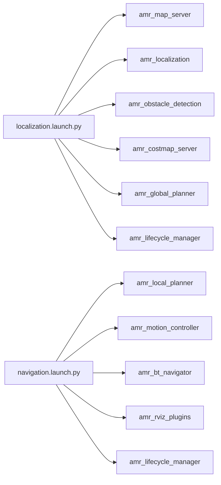

# amr_bringup

`amr_bringup` owns stack startup, shared runtime parameters, RViz configuration, and helper scripts.

## Launch Files

- [localization.launch.py](./launch/localization.launch.py)
  - `amr_map_server`
  - `amr_localization`
  - `amr_obstacle_detection`
  - `amr_costmap_server`
  - `amr_global_planner`
  - `amr_lifecycle_manager`
- [navigation.launch.py](./launch/navigation.launch.py)
  - `amr_local_planner`
  - `amr_motion_controller`
  - `amr_bt_navigator`
  - `amr_rviz_plugins`
  - `amr_lifecycle_manager`

This package launches nodes directly. It does not include per-package launch files.

`localization.launch.py` also supports a lightweight mapping startup path:

```bash
ros2 launch amr_bringup localization.launch.py mapping_mode:=true
```

In mapping mode, `amr_map_server` runs in live mapping mode while `amr_localization` and `amr_global_planner` stay disabled.
The current mapping-mode flow is now:

- `amr_map_server` builds `/amr/map/temporary`
- `amr_map_server` uses `/odom` for translation and `/imu` for heading in bootstrap dead reckoning
- `amr_map_server` refines the predicted pose with lightweight local scan matching against the temporary map
- `amr_map_server` publishes a corrected `map -> odom` TF from the latest mapping pose so RViz can visualize the temporary map, robot, and scan together
- `amr_map_server` can evaluate temporary-map quality and save a promoted official map as `pgm + yaml`
- `amr_map_server` can also auto-save once the quality check passes for the configured number of consecutive cycles

## Runtime Assets

- shared params: [amr.yaml](./params/amr.yaml)
- RViz config: [amr.rviz](./rviz/amr.rviz)
- helper scripts:
  - [send_goal.sh](./script/send_goal.sh)
  - [initialpose.sh](./script/initialpose.sh)

## Startup Layout



## Notes

- all runtime node parameters are centralized in one file
- `amr_lifecycle_manager` is responsible for managed initial pose publication after lifecycle bringup
- RViz goal forwarding is enabled by the `amr_rviz_plugins` bridge node
