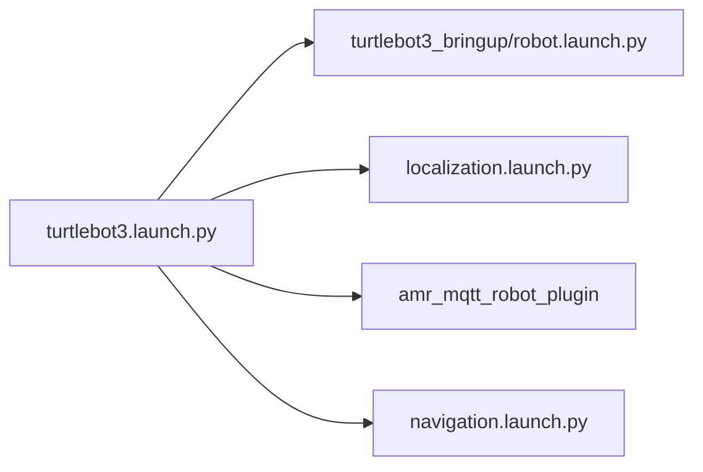

# amr_bringup

`amr_bringup` owns launch files, shared runtime parameters, RViz configuration,
and helper scripts for the AMR stack.

## Launch Files

- [localization.launch.py](./launch/localization.launch.py)
  - `amr_map_server`
  - `amr_localization`
  - `amr_obstacle_detection`
  - `amr_costmap_server`
  - `amr_global_planner`
  - `amr_lifecycle_manager`
- [navigation.launch.py](./launch/navigation.launch.py)
  - `amr_local_planner`
  - `amr_motion_controller`
  - `amr_bt_navigator`
  - `amr_rviz_plugins`
  - `amr_lifecycle_manager`
- [turtlebot3.launch.py](./launch/turtlebot3.launch.py)
  - `turtlebot3_bringup/robot.launch.py`
  - delayed localization bringup
  - delayed `amr_mqtt_robot_plugin`
  - delayed navigation bringup

## Deployment Intent

- `turtlebot3.launch.py` is the robot-side total bringup entry point
- `amr_mqtt_bridge` is launched separately on VBox/server side
- shared parameter ownership stays in [`amr.yaml`](./params/amr.yaml)

## Mapping Mode

`localization.launch.py` also supports a lightweight mapping startup path:

```bash
ros2 launch amr_bringup localization.launch.py mapping_mode:=true
```

In mapping mode:

- `amr_map_server` builds `/amr/map/temporary`
- bootstrap mapping uses `/odom` translation and `/imu` heading
- lightweight local scan matching refines the predicted pose
- a corrected `map -> odom` transform is published for visualization
- temporary maps can be evaluated, promoted, and saved as `pgm + yaml`

## Runtime Assets

- shared params: [amr.yaml](./params/amr.yaml)
- RViz config: [amr.rviz](./rviz/amr.rviz)
- helper scripts:
  - [send_goal.sh](./script/send_goal.sh)
  - [initialpose.sh](./script/initialpose.sh)

## Bringup Layout



## Notes

- all major runtime wiring is centralized in one file
- `amr_lifecycle_manager` handles managed startup ordering
- RViz command topics such as `/amr/rviz/goal` and `/amr/localization/initial_pose`
  are bridged into MQTT by VBox-side `amr_mqtt_bridge`
