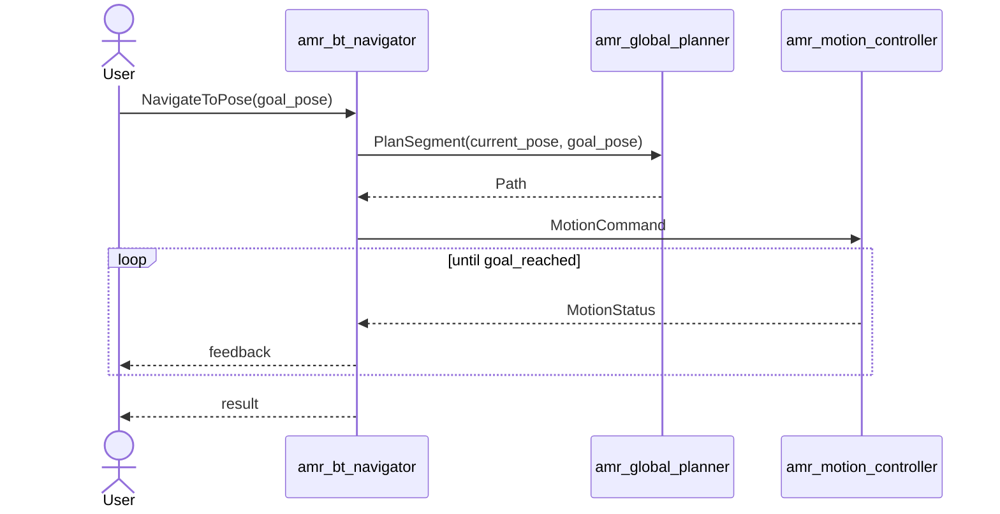

# amr_bt_navigator

`amr_bt_navigator` accepts goal requests, asks the global planner for a path, dispatches `MotionCommand`, and tracks motion status until completion.

## Interfaces

- subscribes: `/amr/localization/pose`
- subscribes: `/amr/motion/status`
- subscribes: `/amr/obstacle/report`
- publishes: `/amr/motion/command`
- calls: `/amr/global_planner/plan_segment`
- serves action: `/amr/navigator/navigate_to_pose`

## Execution Logic

- receives a `NavigateToPose` goal
- reads the latest estimated pose
- receives obstacle reports that will feed future behavior-level recovery and replanning decisions
- requests a global segment plan from the current pose to the goal
- publishes a `MotionCommand` containing the global path and goal pose
- monitors `MotionStatus` until goal reached, cancel, or failure
- publishes periodic action feedback with current pose, remaining distance, and heading error

## Goal Flow

## Notes

- the node is lifecycle-managed but currently uses a lightweight action orchestration flow rather than a full behavior tree engine
- `default_node_id` remains available for internal command metadata
