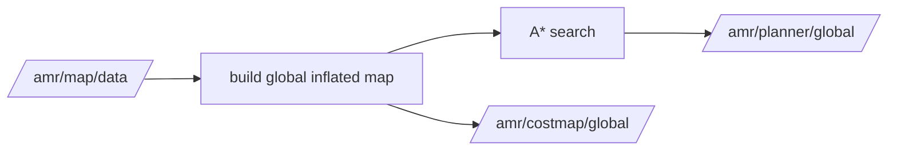

# amr_global_planner

`amr_global_planner` provides occupancy-grid A* planning on an inflated global costmap.

## Interfaces

- subscribes: `/amr/map/data`
- serves: `/amr/global_planner/plan_segment`
- serves: `/amr/global_planner/plan_route`
- publishes: `/amr/planner/global`
- publishes: `/amr/costmap/global`

## Planning Model

- search space: 2D occupancy grid cells
- planner: A*
- planning grid: inflated occupancy map
- connectivity: 4 or 8
- heuristic:
  - Manhattan for 4-connectivity
  - diagonal distance for 8-connectivity
- extra cost:
  - optional `turn_penalty` when direction changes

## Costmap Behavior

- inflates occupied cells from the static map before planning
- can keep unknown space blocked or traversable based on `planner.allow_unknown`
- relocates start or goal to the nearest free cell when the request lands inside inflated space
- publishes the inflated map for RViz debugging

## Global Planning Pipeline

## Post-processing

- returns a dense cell-by-cell path converted back to world poses
- publishes the same path for visualization and downstream local planning
