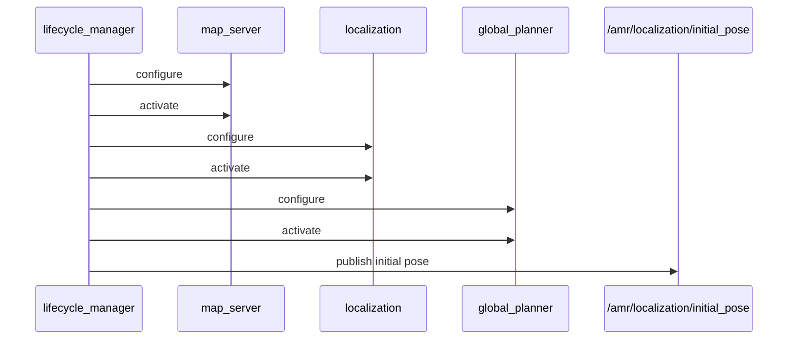

# amr_lifecycle_manager

`amr_lifecycle_manager` brings AMR lifecycle nodes through `configure -> activate` in sequence and can publish an initial pose after all managed nodes are active.

## Responsibilities

- waits for `get_state` and `change_state` services on managed lifecycle nodes
- configures and activates each managed node in order
- optionally publishes `/amr/localization/initial_pose` only after bringup is complete

## Typical Use

- `localization_manager`
  - manages `map_server`, `localization`, `global_planner`
  - publishes initial pose after activation
- `navigation_manager`
  - manages `local_planner`, `motion_controller`, `navigator`
  - no initial pose publish

