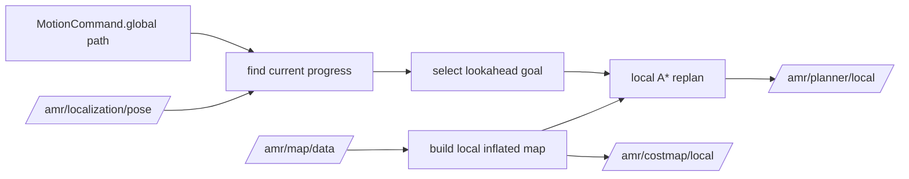

# amr_local_planner

`amr_local_planner` converts a global path into a short-horizon local plan using the current pose, a local inflated costmap, and local A* replanning.

## Interfaces

- subscribes: `/amr/motion/command`
- subscribes: `/amr/localization/pose`
- subscribes: `/amr/map/data`
- publishes: `/amr/planner/local`
- publishes: `/amr/costmap/local`

## Local Planning Logic

- receives the latest `MotionCommand` from the navigator
- finds progress on the global path relative to the current pose
- selects a short-horizon local goal using `lookahead_distance`
- builds a local inflated map from the static occupancy grid
- runs local A* from the current pose to the local goal on the inflated map
- falls back to sliced path output if local replanning fails

## Local Replanning Flow

## Notes

- the current implementation is a costmap-lite local planner rather than a full DWB or TEB controller
- local plan quality depends on current pose stability, costmap inflation, and local goal selection
