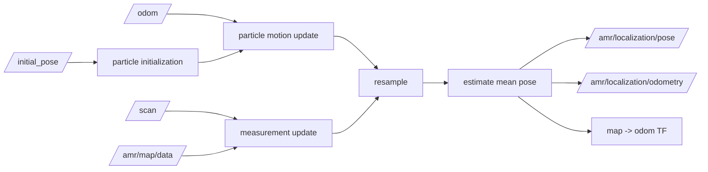

# amr_localization

`amr_localization` estimates the robot pose from `/odom`, `/scan`, and the static occupancy map, then publishes `map -> odom` and the estimated pose outputs.

## Interfaces

- subscribes: `/odom`
- subscribes: `/scan`
- subscribes: `/amr/map/data`
- subscribes: `/amr/localization/initial_pose`
- publishes: `/amr/localization/pose`
- publishes: `/amr/localization/odometry`
- publishes TF: `map -> odom`

## Estimation Model

- localization style: AMCL-lite particle filter
- motion update:
  - integrates odometry deltas with configurable motion noise
- measurement update:
  - scores particles against the occupancy map using sampled scan beams
- resampling:
  - systematic resampling after weight normalization
- initialization:
  - manual initial pose or optional automatic origin-station initial pose

## Localization Pipeline

## Notes

- this node is intentionally lightweight and does not yet aim to match full Nav2 AMCL behavior
- automatic initial pose is useful for fixed-dock or fixed-origin startup
