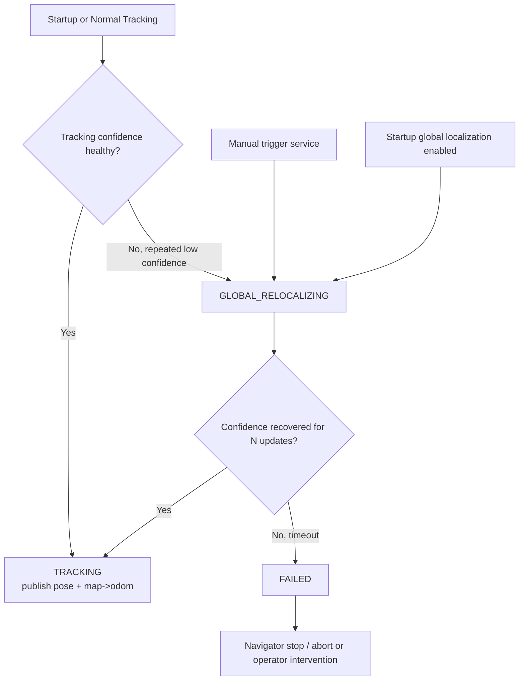
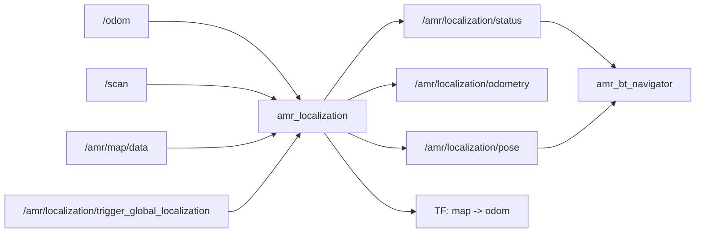

# amr_localization

Localization node for the AMR stack.

## Role

- consumes odometry, scan, and map
- estimates the robot pose in `map`
- owns tracking vs global-relocalization mode for kidnapped recovery
- can start directly in global relocalization instead of forcing a fixed initial pose
- publishes `map -> odom`
- publishes localized pose and odometry topics used by the rest of the stack
- publishes localization status and exposes a trigger for global relocalization

## Principle

`amr_localization` is now split into two practical phases:

- `TRACKING`
  - particles stay clustered around the currently trusted pose
  - odometry applies the motion prior
  - scan-to-map likelihood keeps the cluster aligned to the static map
- `GLOBAL_RELOCALIZING`
  - particles are reinitialized across free cells of the full map
  - scan likelihood is used to search for a globally consistent pose again
  - once confidence stays high for several updates, the node returns to `TRACKING`

This keeps kidnapped handling inside localization instead of pushing particle-filter logic into
the navigator.

## Mode Flow

## Data Flow

## Kidnapped Recovery Notes

- startup can begin from global relocalization instead of forcing a fixed `0,0` seed
- manual `initial_pose` still overrides the particle set and returns the node to `TRACKING`
- `LocalizationStatus` is the public contract used by the navigator:
  - `MODE_TRACKING`
  - `MODE_GLOBAL_RELOCALIZING`
  - `MODE_FAILED`
- the navigator should only decide `hold / resume / abort`; localization keeps ownership of
  particle reset, confidence, and relocalization success/failure semantics

## Outputs

- `/amr/localization/pose`
- `/amr/localization/odom`
- `/amr/localization/status`
- TF `map -> odom`
- `/amr/localization/trigger_global_localization`
