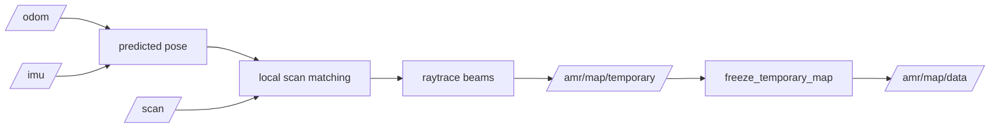

# amr_map_server

`amr_map_server` supports two map supply modes:

- static mode
  - loads a map YAML file, converts the referenced image into an occupancy grid, and publishes it on `/amr/map/data`
- mapping mode
  - starts from an empty occupancy grid and updates it from `/odom`, `/imu`, and `/scan`
  - publishes the in-progress map on `/amr/map/temporary`

It also serves `GetMap` in both modes.

## Interfaces

- publishes: `/amr/map/data`
- publishes: `/amr/map/temporary`
- serves: `/amr/map_server/get_map`
- serves: `/amr/map_server/freeze_temporary_map`
- serves: `/amr/map_server/evaluate_temporary_map`
- serves: `/amr/map_server/save_temporary_map`

## Map Loading Model

- input:
  - YAML file path from `files.yaml`
- reads:
  - image path
  - resolution
  - origin
  - occupied threshold
  - free threshold
  - negate mode
- output:
  - `nav_msgs/msg/OccupancyGrid`

## Mapping Mode

- enabled by `mode.mapping = true`
- consumes:
  - `mapping.topics.pose`
  - `mapping.topics.imu`
  - `mapping.topics.scan`
- current bootstrap pose source:
  - `/odom` for translation
  - `/imu` for heading stabilization
- current refinement step:
  - local scan matching around the predicted pose against `/amr/map/temporary`
- initializes an empty occupancy grid from:
  - `mapping.resolution`
  - `mapping.width`
  - `mapping.height`
  - `mapping.origin.{x,y,yaw}`
- updates free and occupied cells by raytracing LiDAR beams
- publishes `map -> odom` from the latest corrected mapping pose so RViz scan and robot overlays stay closer to the temporary map
- uses odometry position with IMU-referenced yaw to reduce heading-driven map shear
- applies lightweight local scan matching before raytracing each scan into the temporary map
- uses score accumulation and decay so transient obstacles do not remain permanently painted
- keeps `/amr/map/data` reserved as the official navigation map
- promotes the current temporary map into `/amr/map/data` through `freeze_temporary_map`
- can evaluate map readiness from coverage and inflated navigable free-space ratios
- can save the promoted map as `pgm + yaml` after quality checks pass
- can auto-save once the quality checks pass for the configured number of consecutive evaluations

## Notes

- the node is lifecycle-managed
- the official map on `/amr/map/data` is intended for localization and both planners
- the temporary map on `/amr/map/temporary` is intended for mapping-time visualization and review
- mapping mode is intended as the first step toward a fully custom mapping workflow
