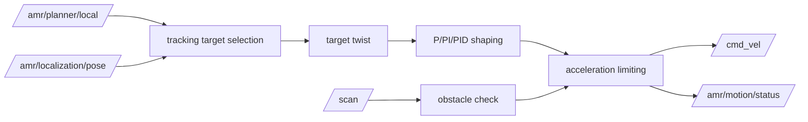

# amr_motion_controller

`amr_motion_controller` converts the current local plan into velocity commands shaped by a selectable `P`, `PI`, or `PID` controller.

## Interfaces

- subscribes: `/amr/localization/pose`
- subscribes: `/scan`
- subscribes: `/amr/motion/command`
- subscribes: `/amr/planner/local`
- publishes: `/amr/motion/status`
- publishes: `/cmd_vel`

## Control Logic

- tracks the latest local plan toward the active goal pose
- computes heading error from the selected tracking target
- supports direct motion and near-goal rotate-in-place behavior
- shapes linear and angular output with `velocity_controller.mode = p | pi | pid`
- applies acceleration limiting to smooth output changes

## Safety and Supervision

- front-sector LiDAR obstacle stop from `/scan`
- goal success based on configured distance tolerance
- periodic `MotionStatus` reporting for the navigator

## Controller Pipeline

## Notes

- the current controller is tuned for MVP navigation and still has room to improve path-faithful tracking on sharp local-plan curvature
