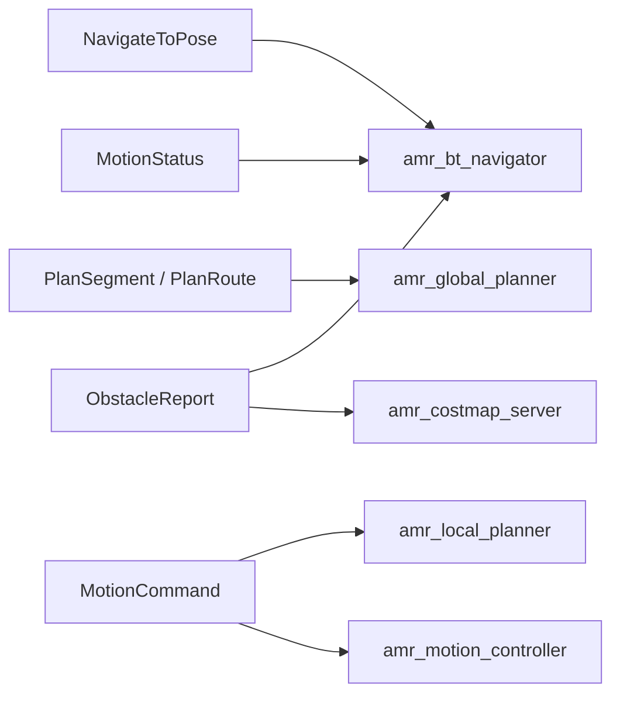

# amr_msgs

`amr_msgs` contains the shared ROS 2 interfaces used by the AMR navigation stack.

## Actions

- [NavigateToPose.action](./action/NavigateToPose.action)
  - goal: `geometry_msgs/PoseStamped goal_pose`
  - result:
    - `bool success`
    - `string message`
  - feedback:
    - `geometry_msgs/PoseStamped current_pose`
    - `float64 remaining_distance`
    - `float64 heading_error`

## Messages

- [MotionCommand.msg](./msg/MotionCommand.msg)
  - command metadata plus the dispatched global path and goal pose
- [MotionStatus.msg](./msg/MotionStatus.msg)
  - controller execution state, goal status, obstacle state, and live pose metrics
- [ObstacleReport.msg](./msg/ObstacleReport.msg)
  - obstacle detection summary with distance, bearing, severity, and dynamic/static context

## Services

- [PlanSegment.srv](./srv/PlanSegment.srv)
  - single start-to-goal planning request
- [PlanRoute.srv](./srv/PlanRoute.srv)
  - multi-waypoint planning request

## Interface Graph

