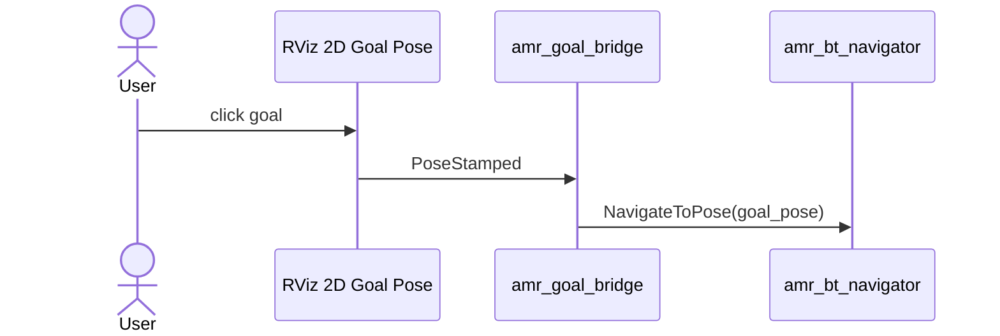

# amr_rviz_plugins

`amr_rviz_plugins` currently provides a lightweight RViz bridge node rather
than a compiled custom RViz panel or tool.

## Current Node

- `amr_goal_bridge`
  - receives `geometry_msgs/msg/PoseStamped` from RViz `2D Goal Pose`
  - forwards the pose to the local AMR action server as `NavigateToPose`

## Interfaces

- subscribes: `/amr/rviz/goal`
- sends action goal: `/amr/navigator/navigate_to_pose`

## Important Deployment Note

This package is for a local ROS graph where RViz and `amr_bt_navigator` can
talk directly.

In the split TB3/VBox deployment:

- VBox RViz publishes `/amr/rviz/goal`
- VBox `amr_mqtt_bridge` emits the corresponding MQTT command
- robot-side `amr_mqtt_robot_plugin` dispatches the actual local action goal

So `amr_goal_bridge` is not the cross-machine transport mechanism.

## Goal Bridge Flow

## Notes

- despite the package name, this package currently contains bridge utilities
- cross-machine goal transport is handled by the MQTT packages
