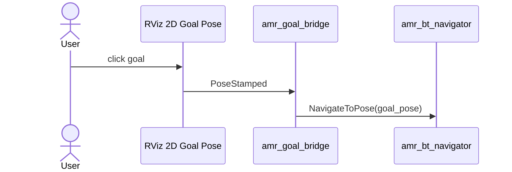

# amr_rviz_plugins

`amr_rviz_plugins` currently provides a lightweight RViz bridge node rather than a compiled custom RViz panel or tool.

## Interfaces

- subscribes: `/amr/rviz/goal`
- sends action goal: `/amr/navigator/navigate_to_pose`

## Current Node

- `amr_goal_bridge`
  - receives `geometry_msgs/msg/PoseStamped` from RViz `2D Goal Pose`
  - forwards the pose to the AMR action server as `NavigateToPose`

## Goal Bridge Flow

## Notes

- despite the package name, this package currently contains bridge utilities and can evolve into true RViz plugins later if needed
