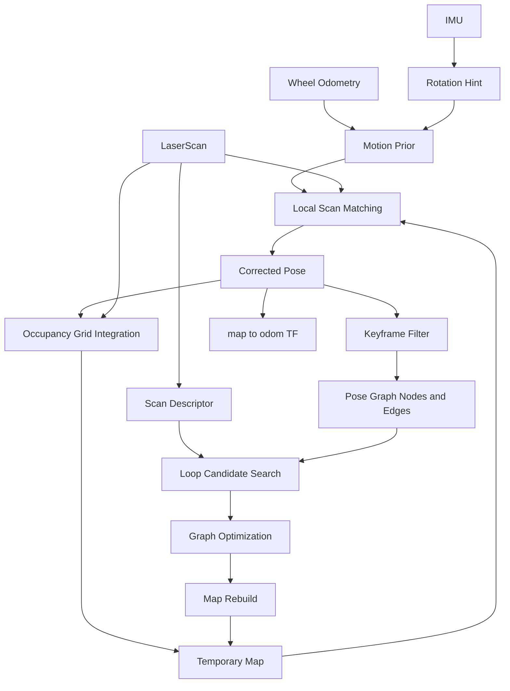
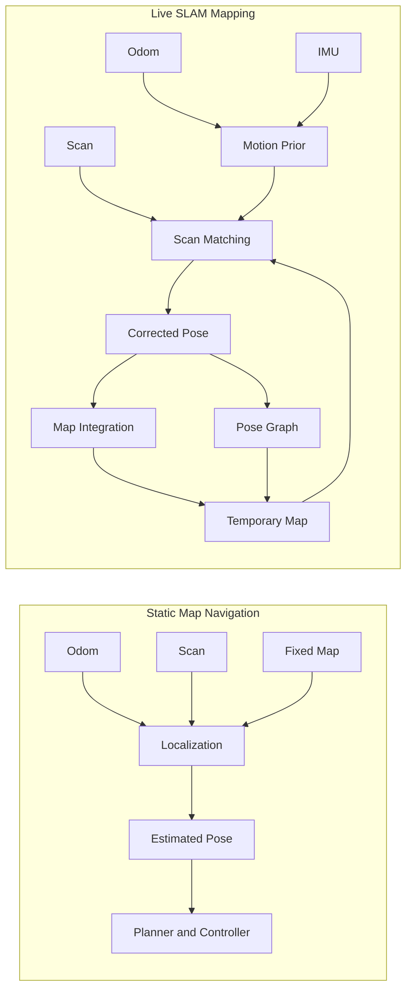

# amr_slam_mapper

Pure SLAM mapping runtime for temporary occupancy-grid generation.

## Role

- subscribes to `/odom`, `/imu`, and `/scan`
- runs a local scan-matching front-end
- accumulates keyframes into a pose-graph structure
- searches loop-closure candidates from scan descriptors
- applies lightweight graph optimization when a loop closure is accepted
- publishes the live raw temporary SLAM map on `/amr/map/temp/raw`
- publishes the refined temporary SLAM map on `/amr/map/temp/refined`
- keeps `/amr/map/temp` as a refined compatibility alias
- publishes corrected mapping odometry on `/amr/slam_mapper/odometry`

## Important Topics

- `/amr/map/temp/raw`
- `/amr/map/temp/refined`
- `/amr/map/temp`
- `/amr/slam_mapper/odometry`

## Algorithm Summary

The current `amr_slam_mapper` pipeline is organized as a lightweight pose-graph SLAM flow:

1. Read the latest raw odometry pose for translation.
2. Build a motion prior from wheel odometry, and only blend IMU heading as a limited hint during active rotation.
3. Apply local scan matching around the predicted pose and choose the highest-scoring candidate against the current temporary map.
4. Integrate the corrected scan into the temporary occupancy-grid map as free/occupied evidence.
5. Filter poses into keyframes and append them as pose-graph nodes with odometry relative edges.
6. Suppress over-dense keyframes in rotation-only segments so the graph does not overfit turn-in-place or low-translation turns.
7. Search loop-closure candidates using a compact scan descriptor, then locally rescore nearby poses with scan matching.
8. When a loop closure is accepted, run lightweight graph optimization and rebuild the temporary map from optimized node poses.

## Why Rotation Drift Stays Low

- Translation mainly follows raw odometry.
- Heading can be assisted by IMU only during rotation-heavy motion.
- Each incoming scan is locally re-aligned against the current map before integration.
- Accepted loop closures add additional yaw and position constraints into the pose graph.

## IMU / Localization Notes

### 1. AMR 주행에서 IMU의 역할

- IMU는 본질적으로 `yaw / angular velocity` 같은 회전 정보를 보강하는 센서입니다.
- 기존 정적 맵 기반 AMR 주행에서는 planner/controller가 직접 IMU를 강하게 의존하기보다,
  `odom + localization + TF` 전체 사슬 안에서 회전 안정성을 보조하는 역할에 가깝습니다.
- 즉 IMU는 단독 위치추정기가 아니라, **회전 오차를 줄이는 보조 센서**로 보는 게 맞습니다.

### 2. Navigation 과 Mapping 에서 IMU Yaw 영향력이 다른 이유

- 정적 맵 기반 navigation/localization:
  - 이미 고정된 정답 map 이 있습니다.
  - odom 이나 IMU yaw 가 조금 틀어져도, scan-to-map matching 이 계속 pose 를 map 쪽으로 끌어옵니다.
  - 그래서 IMU 사용 방식이 조금 거칠어도 운영상 티가 덜 납니다.
- live SLAM mapping:
  - 지금 추정한 pose 로 지금 map 을 그립니다.
  - pose 가 조금 틀어지면 그 오차가 map 에 박히고, 다음 scan matching 기준도 같이 흐려집니다.
  - 그래서 IMU yaw 를 잘못 섞으면 그 오차가 바로 map 왜곡으로 누적됩니다.

즉 같은 IMU 라도:

- 정적 맵 localization 에서는 `보조 오차`
- live SLAM 에서는 `누적 구조 왜곡`

으로 나타날 수 있습니다.

### 3. Navigation 의 Localization 과 Live SLAM 의 Localization 차이

- 정적 맵 기반 localization:
  - 입력: `odom + scan + fixed map`
  - 출력: `estimated pose`, `map -> odom`
  - 핵심: 이미 존재하는 map 에 현재 robot pose 를 맞춥니다.
- live SLAM 기반 localization:
  - 입력: `odom + scan + evolving temporary map`
  - 출력: `corrected pose`, `map -> odom`, temporary map 자체
  - 핵심: pose 와 map 을 같이 추정합니다.

그래서 live SLAM 은:

- motion prior 일관성
- 회전 구간 처리
- loop closure 품질

에 훨씬 민감합니다.

## Mermaid Overview

## Static Map Localization vs Live SLAM

## Practical Takeaway

- 정적 맵 navigation 은 `고정된 map` 이 오차를 계속 잡아줍니다.
- live SLAM 은 `pose 오차가 map 오차로 곧바로 누적`됩니다.
- 그래서 `amr_slam_mapper`에서는:
  - IMU를 yaw 정답으로 덮어쓰지 않고
  - 회전 구간에서만 제한적으로 사용하고
  - 회전-only keyframe 을 억제하는 방향이 더 안전합니다.

## Notes

- this package is focused on pure SLAM mapping only
- frontier / explore / completion-to-nav conversion should stay outside this package
